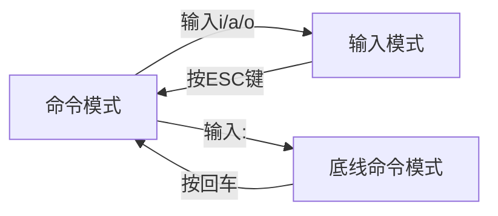

# Linux 基础命令大全（文件/目录操作核心篇）
本文整理了 Linux（含 WSL）日常开发中最常用的文件/目录操作命令，涵盖命令格式、核心用法、示例及注意事项，适合新手直接查阅使用。

## 一、Linux 命令通用格式
所有 Linux 命令遵循统一基础格式，掌握后可快速理解各类命令用法：
```bash
command [-options] [parameter]
```
### 格式说明：
| 组成部分   | 含义                                                                 |
|------------|----------------------------------------------------------------------|
| `command`  | 命令本身（如 `ls`、`cd`，核心功能入口）                               |
| `-options` | 可选参数，控制命令行为细节（如 `-l`、`-r`，可组合使用，如 `-lr`）     |
| `parameter`| 可选参数，指定命令操作目标（如文件路径、目录名，支持多个参数用空格分隔）|

> 语法中的 `[]` 表示可选，无需输入；选项前的 `-` 是固定格式（部分长选项用 `--`，如 `--help`）。

### 示例：
```bash
# 以列表形式查看 /home 目录内容
ls -l /home  # command=ls，options=-l，parameter=/home

# 递归复制 test 文件夹到 backup 目录
cp -r test backup  # command=cp，options=-r，parameter=test、backup
```

## 二、目录操作核心命令（cd/pwd/ls/mkdir）
### 1. cd 命令：切换工作目录
- 英文全称：Change Directory
- 作用：切换当前终端的工作目录
- 语法：`cd [目标路径]`（无选项，仅需指定路径）
- 特殊路径符用法（高频必备）：

| 路径符 | 含义                  | 示例                                  |
|--------|-----------------------|---------------------------------------|
| `.`    | 当前目录              | `cd ./Desktop`（进入当前目录下的 Desktop） |
| `..`   | 上一级目录            | `cd ..`（返回上一级）、`cd ../..`（返回上两级） |
| `~`    | 当前用户家目录（/home/用户名） | `cd ~`（快速回到家目录）、`cd ~/Downloads`（进入家目录下的 Downloads） |
| 无参数 | 默认切换到家目录      | `cd`（等同于 `cd ~`）                  |

### 2. pwd 命令：查看当前工作目录
- 英文全称：Print Work Directory
- 作用：输出当前终端所在的绝对路径
- 语法：`pwd`（无选项、无参数，直接执行）
- 示例：
  ```bash
  pwd  # 输出示例：/home/ubuntu/Documents
  ```

### 3. ls 命令：列出目录内容
- 英文全称：List
- 作用：查看指定目录下的文件/文件夹（默认查看当前目录）
- 语法：`ls [-options] [目录路径]`（无路径时默认当前目录）
- 核心选项：

| 选项 | 作用                                  | 示例                                  |
|------|---------------------------------------|---------------------------------------|
| `-l` | 以列表形式展示（含权限、大小、修改时间等细节） | `ls -l ~`（列表查看家目录内容）        |
| `-a` | 显示隐藏文件/文件夹（以 `.` 开头的文件） | `ls -a`（查看当前目录所有文件，含隐藏文件） |
| `-h` | 与 `-l` 搭配，以人性化单位显示文件大小（KB/MB/GB） | `ls -lh`（列表+人性化大小）            |
| 组合 | 选项可组合使用                        | `ls -lah`（等同于 `ls -l -a -h`，显示所有文件+列表+人性化大小） |

### 4. mkdir 命令：创建目录
- 英文全称：Make Directory
- 作用：创建新的文件夹
- 语法：`mkdir [-p] 目录路径`
- 核心选项：
  - `-p`：递归创建多层目录（父目录不存在时自动创建，必备！）
- 示例：
  ```bash
  # 创建单个目录（当前目录下的 test 文件夹）
  mkdir test

  # 创建多层目录（递归创建 a/b/c，父目录 a、a/b 自动生成）
  mkdir -p a/b/c

  # 相对路径创建（当前目录下的 docs/note 目录）
  mkdir -p docs/note
  ```

## 三、文件操作核心命令（touch/cat/more）
### 1. touch 命令：创建文件
- 作用：创建空文件（若文件已存在，仅更新文件修改时间）
- 语法：`touch 文件路径`（支持相对路径、绝对路径、特殊路径符）
- 示例：
  ```bash
  # 在当前目录创建 test.txt 文件
  touch test.txt

  # 在家目录的 Documents 下创建 report.md 文件
  touch ~/Documents/report.md

  # 批量创建多个文件
  touch file1.txt file2.csv file3.log
  ```

### 2. cat 命令：查看文件内容
- 作用：快速查看文件内容（适合内容较少的文件，一次性输出所有内容）
- 语法：`cat 文件路径`
- 示例：
  ```bash
  # 查看当前目录下的 test.txt 内容
  cat test.txt

  # 查看家目录下的 Documents/report.md 内容
  cat ~/Documents/report.md
  ```

### 3. more 命令：分页查看文件内容
- 作用：查看大文件（内容过多时分页显示，避免刷屏）
- 语法：`more 文件路径`
- 核心操作（查看时使用）：
  - 按 **空格** 键：向下翻一页
  - 按 **Enter** 键：向下翻一行
  - 按 **q** 键：退出查看（必备！）
- 示例：
  ```bash
  # 分页查看大文件 log.txt
  more log.txt
  ```

## 四、文件/目录操作命令（cp/mv/rm）
### 1. cp 命令：复制文件/目录
- 英文全称：Copy
- 作用：复制文件或文件夹到指定位置
- 语法：`cp [-r] 源路径 目标路径`
- 核心选项：
  - `-r`：递归复制（仅复制文件夹时必须加，否则无法复制子目录和文件）
- 参数说明：
  - 源路径：被复制的文件/文件夹路径
  - 目标路径：复制后的存放路径
- 示例：
  ```bash
  # 复制文件（将 test.txt 复制到 docs 目录下）
  cp test.txt docs/

  # 复制文件夹（将 docs 复制到 backup 目录下，必须加 -r）
  cp -r docs backup/

  # 复制并改名（将 test.txt 复制到 docs 目录下，并重命名为 new_test.txt）
  cp test.txt docs/new_test.txt
  ```

### 2. mv 命令：移动/重命名文件/目录
- 英文全称：Move
- 作用：两种核心用法（无需额外选项，一键实现）：
  1. 移动文件/文件夹到指定位置
  2. 重命名文件/文件夹（目标路径不存在时自动触发）
- 语法：`mv 源路径 目标路径`
- 示例：
  ```bash
  # 移动文件（将 test.txt 移动到 docs 目录下）
  mv test.txt docs/

  # 重命名文件（将 test.txt 改名为 report.txt）
  mv test.txt report.txt

  # 重命名文件夹（将 docs 改名为 documents）
  mv docs documents

  # 移动并改名（将 docs 移动到 backup 目录下，并重命名为 docs_backup）
  mv docs backup/docs_backup
  ```

### 3. rm 命令：删除文件/目录（高危！谨慎使用）
- 英文全称：Remove
- 作用：删除文件或文件夹（删除后无法恢复，无回收站！）
- 语法：`rm [-r -f] 目标路径1 目标路径2 ...`（支持多个目标，空格分隔）
- 核心选项：

| 选项 | 作用                                  | 适用场景                  |
|------|---------------------------------------|---------------------------|
| `-r` | 递归删除（仅删除文件夹时必须加）      | 删除非空文件夹            |
| `-f` | 强制删除（跳过确认提示，不报错）      | 避免频繁确认，普通用户慎用 |

- 关键注意事项：
  - 操作文件夹必须加 `-r`，否则报错（`rm: 无法删除'目录名': 是一个目录`）
  - `rm -rf` 是高危命令，禁止对系统目录（如 `/`、`/usr`、`/home`）使用
  - 支持通配符 `*` 模糊匹配（如 `rm *.txt` 删除所有 `.txt` 文件）
- 示例：
  ```bash
  # 删除单个文件（直接删除，无提示）
  rm test.txt

  # 删除空文件夹（加 -r 或 -d 均可）
  rm -r empty_dir  # 推荐
  rm -d empty_dir  # 仅适用于空文件夹

  # 删除非空文件夹（必须加 -r）
  rm -r docs

  # 强制删除（无提示，谨慎使用）
  rm -rf temp_dir/ report.pdf

  # 模糊删除（删除当前目录下所有 .log 文件）
  rm *.log
  ```

## 五、关键补充说明
### 1. 相对路径 vs 绝对路径
- 相对路径：以当前目录为起点（如 `docs/test.txt`、`../Desktop`），无需加 `/` 开头
- 绝对路径：以系统根目录 `/` 为起点（如 `/home/ubuntu/docs`、`/tmp`），必须加 `/` 开头
- 路径中 `/` 的使用规则：
  - 操作目录时：可加可不加（推荐加，更清晰），如 `cd docs/`、`cp -r docs/ backup/`
  - 操作文件时：绝对不能加 `/`，如 `touch test.txt`（正确）、`touch test.txt/`（错误）
  - 多层路径时：必须加 `/` 作为分隔符，如 `cd docs/note`、`cat a/b/c.txt`

### 2. 权限相关提示
- 普通用户默认对**家目录（/home/用户名）** 有完全权限（可创建、删除、修改文件/目录）
- 对系统目录（如 `/usr`、`/etc`）需用 `sudo` 临时提权（如 `sudo rm -rf /tmp/old_dir`）
- 查看文件/目录权限：`ls -ld 目标路径`（如 `ls -ld ~` 查看家目录权限）

### 3. 高危命令避坑
- 禁止执行 `rm -rf /`（删除系统所有文件，直接崩溃）
- 禁止执行 `rm -rf /*`（同上，通配符匹配所有系统文件）
- WSL 环境中，避免对 `/mnt/c`（Windows C 盘）执行 `rm -rf`（会删除 Windows 系统文件）
- 删除前建议先用 `ls` 确认路径（如 `ls temp_dir` 确认文件夹内容后再删除）

# 查找类命令：which、find

## 一、which命令：查找命令的程序文件
- 作用：定位系统中**命令对应的可执行程序文件**（比如`ls`、`cd`命令实际存放在哪个目录）
- 语法：
  ```bash
  which 要查找的命令
  ```
- 说明：无需选项，仅需指定要查找的命令名称
- 示例：
  ```bash
  # 查找ls命令的程序文件路径
  which ls
  # 输出示例：/usr/bin/ls

  # 查找find命令的程序文件路径
  which find
  # 输出示例：/usr/bin/find
  ```


## 二、find命令：查找指定文件/目录
- 作用：在指定路径下搜索符合条件的文件/目录（支持按名称、大小等多种条件过滤）
- 核心用法：

### 1. 按文件名查找
- 语法：
  ```bash
  find 起始路径 -name "被查找文件名"
  ```
- 说明：
  - 起始路径：搜索的起点（如`/`表示整个系统，`~`表示家目录）
  - `"被查找文件名"`：支持通配符（如`*.txt`匹配所有txt文件）
- 示例：
  ```bash
  # 在当前目录下查找test.txt文件
  find . -name "test.txt"

  # 在整个系统中查找所有.log结尾的文件
  find / -name "*.log"

  # 在家目录中查找名为docs的文件夹
  find ~ -name "docs"
  ```


### 2. 按文件大小查找
- 语法：
  ```bash
  find 起始路径 -size +|-n[kMG]
  ```
- 说明：
  - `+n`：大于n指定的大小
  - `-n`：小于n指定的大小
  - 单位：`k`（KB）、`M`（MB）、`G`（GB）
- 示例：
  ```bash
  # 在当前目录下查找大于100MB的文件
  find . -size +100M

  # 在/mnt/c目录下查找小于50KB的文件
  find /mnt/c -size -50k

  # 在整个系统中查找大小等于1GB的文件
  find / -size 1G
  ```

  # 文本处理命令：grep、wc 与管道符
## 一、grep命令：按关键字过滤文件内容
- 作用：从文件中通过关键字筛选匹配的行
- 语法：
  ```bash
  grep [-n] "关键字" 文件路径
  ```
- 选项说明：
  - `-n`（可选）：在结果中显示匹配行的行号
- 参数说明：
  - `"关键字"`（必填）：要过滤的内容，建议用双引号包裹（避免特殊字符干扰）
  - `文件路径`（必填）：目标文件的路径，也可作为管道符的输入

### 示例
```bash
# 从test.txt中筛选包含"hello"的行
grep "hello" test.txt

# 筛选包含"error"的行，并显示行号
grep -n "error" log.txt
```


## 二、wc命令：统计文件内容信息
- 作用：统计文件的行数、单词数、字节数、字符数等
- 语法：
  ```bash
  wc [-c -m -l -w] 文件路径
  ```
- 选项说明（可选，默认统计「行数、单词数、字节数」）：
  - `-c`：统计字节数
  - `-m`：统计字符数
  - `-l`：统计行数
  - `-w`：统计单词数
- 参数说明：
  - `文件路径`（必填）：目标文件的路径，也可作为管道符的输入

### 示例
```bash
# 默认统计（行数、单词数、字节数）
wc test.txt

# 仅统计行数
wc -l log.txt

# 统计字符数和单词数
wc -m -w report.md
```


## 三、管道符 `|`：命令结果传递
- 作用：将管道符**左边命令的输出结果**，作为**右边命令的输入内容**，实现多命令组合使用
- 语法：
  ```bash
  命令1 | 命令2
  ```

### 示例
```bash
# 先筛选test.txt中含"hello"的行，再统计这些行的数量
grep "hello" test.txt | wc -l

# 先列出当前目录内容，再筛选包含"doc"的行
ls | grep "doc"
```

# 文本输出与文件操作命令：echo、反引号、重定向符、tail

## 1. echo命令：输出指定内容
- 作用：在命令行内输出指定内容
- 语法：
  ```bash
  echo 输出的内容
  ```
- 说明：
  - 无需选项，仅需一个参数（要输出的内容）
  - 复杂内容（含空格、特殊字符）建议用双引号`""`包裹

### 示例
```bash
# 输出简单文本
echo hello world

# 输出含空格的内容（用双引号包裹）
echo "Hello, itcast"
```


## 2. 反引号符（`）：执行命令并代入结果
- 作用：被反引号包裹的内容，会**先作为命令执行**，再将执行结果作为普通字符代入外层命令
- 场景：需要将一个命令的结果作为另一个命令的参数时使用

### 示例
```bash
# 先执行date命令获取当前时间，再用echo输出
echo `date`

# 将ls命令的结果作为echo的输出内容
echo "当前目录内容：`ls`"
```


## 3. 重定向符：将命令结果写入文件
用于将命令的输出结果保存到文件中，分为“覆盖写入”和“追加写入”：

| 符号 | 作用 | 示例 |
|------|------|------|
| `>` | 将左侧命令结果**覆盖写入**到右侧文件（文件不存在则创建，存在则清空原有内容） | `echo "test" > test.txt`（将"test"写入test.txt，覆盖原有内容） |
| `>>` | 将左侧命令结果**追加写入**到右侧文件（文件不存在则创建，存在则在末尾添加内容） | `echo "new line" >> test.txt`（在test.txt末尾添加"new line"） |


## 4. tail命令：查看文件尾部内容
- 作用：查看文件的尾部内容，支持持续跟踪文件更新（常用于查看日志）
- 语法：
  ```bash
  tail [-f -num] Linux路径
  ```
- 选项说明：
  - `-f`（可选）：持续跟踪文件内容（文件更新时自动显示新内容，按`Ctrl+C`退出）
  - `-num`（可选）：指定查看尾部的行数（默认显示最后10行）
- 参数说明：`Linux路径`为被查看的文件路径

### 示例
```bash
# 查看test.txt的最后10行（默认）
tail test.txt

# 查看test.txt的最后5行
tail -5 test.txt

# 持续跟踪log.txt的更新（日志实时查看）
tail -f log.txt
```

# vi/vim编辑器快速入门
## 一、vim的三种工作模式
vim的核心是**模式切换**，所有操作都围绕“命令模式→输入模式→底线命令模式”的切换展开：

- **命令模式**：vim启动后的默认模式，用于输入指令（切换模式、复制粘贴等）
- **输入模式**：用于编辑文件内容（可输入文字）
- **底线命令模式**：用于执行保存、退出等操作（以`:`开头）


## 二、vim快速体验步骤
以编辑`hello.txt`为例，完整流程：
1. **启动vim**：执行命令进入命令模式
   ```bash
   vim hello.txt
   ```
2. **进入输入模式**：在命令模式下按 `i` 键（`i`=insert，在光标前插入）
3. **编辑内容**：在输入模式下输入文本（比如`itheima and itcast.`）
4. **返回命令模式**：编辑完成后，按 `ESC` 键
5. **进入底线命令模式**：在命令模式下按 `:` 键
6. **保存并退出**：在底线命令模式下输入 `wq`，按回车
   - `w`=write（保存）
   - `q`=quit（退出）


## 三、模式切换关键操作
| 操作场景               | 按键/指令                     |
|------------------------|-------------------------------|
| 命令模式→输入模式      | `i`（光标前插入）/`a`（光标后插入）/`o`（新行插入） |
| 输入模式→命令模式      | `ESC`键                       |
| 命令模式→底线命令模式  | `:`（英文冒号）|
| 底线命令模式→命令模式  | 按`回车`执行指令后自动返回    |

## 四、vim模式切换命令表
| 模式     | 命令 | 描述                               |
|----------|------|------------------------------------|
| 命令模式 | `i`  | 在当前光标位置进入输入模式         |
| 命令模式 | `a`  | 在当前光标位置之后进入输入模式     |
| 命令模式 | `I`  | 在当前行的开头，进入输入模式       |
| 命令模式 | `A`  | 在当前行的结尾，进入输入模式       |
| 命令模式 | `o`  | 在当前光标下一行进入输入模式       |
| 命令模式 | `O`  | 在当前光标上一行进入输入模式       |
| 输入模式 | `esc`| 任何情况下输入esc都能回到命令模式  |