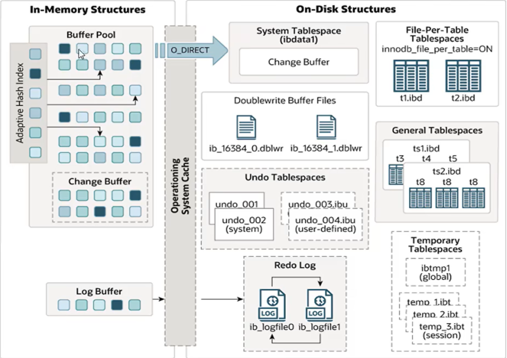

# 逻辑存储结构

MySQL InnoDB 存储引擎将数据划分为多个层级进行管理，从宏观到微观依次为：**表空间 -> 段 -> 区 -> 页 -> 行**。

### 1. 表空间 (Tablespace)

* **定义**：通常对应磁盘上的 `.ibd` 文件。
* **关系**：一个 MySQL 实例可以对应多个表空间。
* **用途**：用于存储记录、索引等核心数据。

### 2. 段 (Segment)

* **分类**：主要分为**数据段**（Leaf node segment）、**索引段**（Non-leaf node segment）和**回滚段**（Rollback segment）。
* **特点**：InnoDB 是索引组织表，数据段即 B+ 树的叶子节点，索引段即 B+ 树的非叶子节点。
* **管理**：段用来管理多个 **Extent（区）**。

### 3. 区 (Extent)

* **定义**：表空间的单元结构。
* **大小**：每个区的固定大小为 **1M**。
* **结构**：在默认情况下，InnoDB 页大小为 **16K**，因此一个区中共有 **64个连续的页**。

### 4. 页 (Page)

* **定义**：是 InnoDB 存储引擎**磁盘管理的最小单元**。
* **大小**：默认大小为 **16KB**。
* **优化**：为了保证页的连续性，InnoDB 存储引擎每次从磁盘申请 4-5 个区。

### 5. 行 (Row)

* **定义**：InnoDB 存储引擎的数据是按行进行存放的。
* **核心隐藏列**：
* **Trx_id**：每次对某条记录进行改动时，都会把对应的事务 ID 赋值给 `trx_id` 隐藏列。
* **Roll_pointer**：回滚指针。每次对某条记录进行改动时，都会把旧的版本写入到 `undo` 日志中，该隐藏列相当于一个指针，可以通过它找到该记录修改前的信息。

# 架构 - 内存架构 (In-Memory Structures)



InnoDB 内存架构主要由以下四个核心部分组成：**Buffer Pool**、**Change Buffer**、**Adaptive Hash Index** 和 **Log Buffer**。

## 1. Buffer Pool (缓冲池)

缓冲池是主内存中的一个区域，里面可以缓存磁盘上经常操作的真实数据。

* **核心逻辑**：在执行增删改查操作时，先操作缓冲池中的数据（若缓冲池没有数据，则从磁盘加载并缓存），然后再以一定频率刷到磁盘，从而减少磁盘 IO，加快处理速度。
* **管理单位**：缓冲池以 **Page (页)** 为单位，底层采用链表数据结构管理 Page。
* **Page 的三种状态**：
* **free page**：空闲 page，未使用。
* **clean page**：被使用 page，数据没有被修改过。
* **dirty page**：脏页，数据被修改过，池中数据与磁盘数据不一致。


---

## 2. Change Buffer (更改缓冲区)

针对**非唯一二级索引页**的操作优化。

* **工作原理**：在执行 DML 语句时，如果这些数据 Page 没有在 Buffer Pool 中，不会直接操作磁盘，而是将数据变更存在 `Change Buffer` 中。
* **合并时机**：在未来数据被读取时，再将数据合并恢复到 Buffer Pool 中，随后将合并后的数据刷新到磁盘。
* **意义**：二级索引插入通常是随机的，有了 Change Buffer 可以在缓冲池中进行合并处理，极大地减少随机磁盘 IO。

---

## 3. Adaptive Hash Index (自适应哈希索引)

用于优化对 Buffer Pool 数据的查询效率。

* **机制**：InnoDB 存储引擎会监控对表上各索引页的查询，如果观察到建立哈希索引可以提升速度，则自动建立哈希索引。
* **特点**：无需人工干预，是系统根据情况自动完成的。
* **相关参数**：`adaptive_hash_index`。

---

## 4. Log Buffer (日志缓冲区)

用来保存要写入到磁盘中的日志数据（如 redo log、undo log）。

* **参数与设置**：
* `innodb_log_buffer_size`：定义缓冲区大小，默认 **16MB**。
* `innodb_flush_log_at_trx_commit`：控制日志刷新到磁盘的时机。


* **刷新时机策略**：
* **1**：日志在每次事务提交时写入并刷新到磁盘（安全性最高）。
* **0**：每秒将日志写入并刷新到磁盘一次。
* **2**：日志在每次事务提交后写入，并每秒刷新到磁盘一次。

# 架构 - 磁盘结构 (On-Disk Structures)

InnoDB 的磁盘结构主要由多种表空间（Tablespaces）、缓冲区文件和日志文件组成。

## 1. 表空间 (Tablespaces)

### 系统表空间 (System Tablespace)

* **定义**：是更改缓冲区（Change Buffer）的存储区域。
* **内容**：如果表是在系统表空间而非独立表文件或通用表空间中创建的，它也可能包含表和索引数据。
* **历史版本**：在 MySQL 5.x 版本中，还包含 InnoDB 数据字典、undo log 等。
* **参数**：`innodb_data_file_path`。

### 每表文件表空间 (File-Per-Table Tablespaces)

* **定义**：每个表的独立表空间包含单个 InnoDB 表的数据和索引。
* **存储**：存储在文件系统上的单个数据文件中。
* **参数**：`innodb_file_per_table`。

### 通用表空间 (General Tablespaces)

* **定义**：需要通过 `CREATE TABLESPACE` 语法创建的通用表空间。
* **使用**：在创建表时，可以指定该表空间。
* **语法示例**：
```sql
CREATE TABLESPACE ts_name ADD DATAFILE 'file_name' ENGINE = engine_name;
CREATE TABLE xxx ... TABLESPACE ts_name;

```


### 撤销表空间 (Undo Tablespaces)

* **定义**：MySQL 实例在初始化时会自动创建两个默认的 undo 表空间（初始大小为 16M）。
* **用途**：用于存储 undo log 日志。

### 临时表空间 (Temporary Tablespaces)

* **定义**：InnoDB 使用会话临时表空间和全局临时表空间。
* **用途**：用于存储用户创建的临时表等数据。

---

## 2. 缓冲区文件 (Buffer Files)

### 双写缓冲区文件 (Doublewrite Buffer Files)

* **定义**：InnoDB 引擎将数据页从 Buffer Pool 刷新到磁盘前，先将数据页写入双写缓冲区文件中。
* **意义**：便于系统异常时恢复数据。
* **文件名示例**：`#ib_16384_0.dblwr`, `#ib_16384_1.dblwr`。

---

## 3. 日志文件 (Log Files)

### 重做日志 (Redo Log)

* **定义**：用来实现事务的持久性。
* **组成**：由重做日志缓冲（Redo Log Buffer，在内存中）以及重做日志文件（Redo Log，在磁盘中）两部分组成。
* **作用**：当事务提交之后会把所有修改信息都存到该日志中，用于在刷新脏页到磁盘发生错误时进行数据恢复。
* **写入方式**：以循环方式写入重做日志文件，涉及两个文件：`ib_logfile0`, `ib_logfile1`。

# 架构 - 后台线程

InnoDB 存储引擎通过多个后台线程来处理不同的任务，确保内存与磁盘数据的一致性以及系统的高性能。

### 1. Master Thread

* **核心角色**：这是最核心的后台线程。
* **职责**：
* 负责调度其他线程。
* 负责将缓冲池中的数据异步刷新到磁盘中，保持数据的一致性。
* 包括脏页的刷新、合并插入缓存、undo 页的回收等。


### 2. IO Thread

在 InnoDB 存储引擎中大量使用了 **AIO (Async IO)** 来处理 IO 请求，这可以极大提高数据库性能。IO Thread 主要负责这些 IO 请求的回调。

| 线程类型 | 默认个数 | 职责 |
| --- | --- | --- |
| **Read thread** | 4 | 负责读操作 |
| **Write thread** | 4 | 负责写操作 |
| **Log thread** | 1 | 负责将日志缓冲区刷新到磁盘 |
| **Insert buffer thread** | 1 | 负责将写缓冲区内容刷新到磁盘 |

### 3. Purge Thread

* **主要用途**：用于回收事务已经提交了的 **undo log**。
* **机制**：在事务提交之后，undo log 可能不再需要了，就由该线程负责回收。

### 4. Page Cleaner Thread

* **职责**：协助 Master Thread 刷新脏页到磁盘的线程。
* **意义**：它可以减轻 Master Thread 的工作压力，减少系统阻塞。

# 事务原理

## 1. 事务 (Transaction)

事务是一组操作的集合，它是一个不可分割的工作单位。事务会把所有的操作作为一个整体一起向系统提交或撤销操作请求，即这些操作要么同时成功，要么同时失败。

## 2. 特性 (ACID)

数据库事务具有四个核心特性：

* **原子性 (Atomicity)**：事务是不可分割的最小操作单元，要么全部成功，要么全部失败。
* **一致性 (Consistency)**：事务完成时，必须使所有的数据都保持一致状态。
* **隔离性 (Isolation)**：数据库系统提供的隔离机制，保证事务在不受外部并发操作影响的独立环境下运行。
* **持久性 (Durability)**：事务一旦提交或回滚，它对数据库中的数据的改变就是永久的。

# 事务原理 - redo log

## 1. 概述

**redo log（重做日志）** 记录的是事务提交时数据页的物理修改情况，主要用来实现事务的**持久性**。

## 2. 组成部分

该日志文件由两部分组成：

* **重做日志缓冲 (redo log buffer)**：位于内存中。
* **重做日志文件 (redo log file)**：位于磁盘中。

## 3. 工作原理

当事务提交之后，系统会把所有修改信息都存到该日志文件中。

* **核心用途**：用于在刷新脏页到磁盘发生错误时，进行数据恢复使用。
* **设计思想**：通过将随机的磁盘 IO 转换为顺序的日志写入，保证了即使数据库宕机，已提交的事务也不会丢失。

# 事务原理 - undo log

## 1. 概述

**undo log（回滚日志）** 主要用于记录数据被修改前的信息，其作用包含两个核心方面：提供**回滚**支持和 **MVCC（多版本并发控制）**。它确保了事务的**原子性**。

## 2. 逻辑日志特性

`undo log` 与记录物理修改的 `redo log` 不同，它属于**逻辑日志**：

* 当执行 `delete` 一条记录时，`undo log` 中会记录一条对应的 `insert` 记录。
* 反之亦然，当执行 `update` 一条记录时，它记录一条对应相反的 `update` 记录。
* **回滚机制**：当执行 `rollback` 时，系统可以从 `undo log` 中的逻辑记录读取到相应的内容并进行回滚。

## 3. 销毁与存储

* **销毁时机**：`undo log` 在事务执行时产生。事务提交时，并不会立即删除 `undo log`，因为这些日志可能还用于 MVCC。
* **存储方式**：`undo log` 采用**段（Segment）**的方式进行管理和记录。
* **存储位置**：存放于回滚段（Rollback Segment）中，内部包含 1024 个 `undo log segment`。

# MVCC - 基本概念

## 1. 当前读 (Current Read)

读取的是记录的最新版本，读取时还要保证其他并发事务不能修改当前记录，会对读取的记录进行加锁。

* **常见操作**：
* `select ... lock in share mode` (共享锁)
* `select ... for update`
* `update`
* `insert`
* `delete` (排他锁)


## 2. 快照读 (Snapshot Read)

简单的 `select` (不加锁) 就是快照读，快照读读取的是记录数据的可见版本，有可能是历史数据，不加锁，是非阻塞读。

* **不同隔离级别下的表现**：
* **Read Committed**：每次 `select`，都生成一个快照读。
* **Repeatable Read**：开启事务后第一个 `select` 语句才是快照读的地方。
* **Serializable**：快照读会退化为当前读。


## 3. MVCC

* **全称**：Multi-Version Concurrency Control，即多版本并发控制。
* **定义**：指维护一个数据的多个版本，使得读写操作没有冲突，快照读为 MySQL 实现 MVCC 提供了一个非阻塞读功能。
* **实现依赖**：MVCC 的具体实现，还需要依赖于数据库记录中的**三个隐藏字段**、**undo log 日志**、以及 **readView**。

