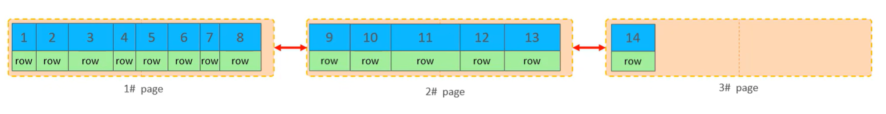
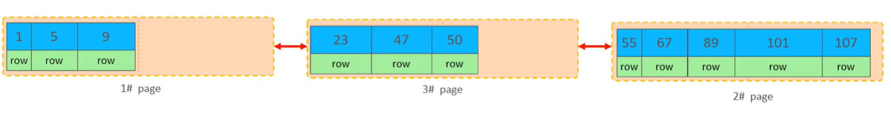
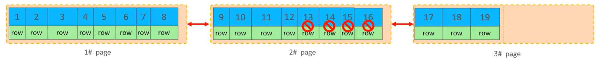
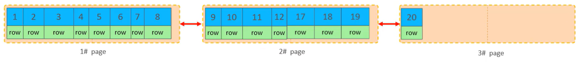
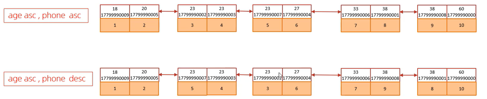

# 插入数据

## 一、 Insert 语句优化

对于少量的批量数据，可以通过以下三种方式提高 `insert` 性能：

### 1. 批量插入 (Batch Insert)

尽量使用一条 insert 语句插入多条数据，而不是多条单行插入语句，以减少网络传输和语法解析的开销。

```sql
Insert into tb_test values(1,'Tom'),(2,'Cat'),(3,'Jerry');

```

### 2. 手动提交事务 (Manual Transaction)

MySQL 默认开启自动提交。对于多条插入语句，可以手动开启事务并统一提交，避免频繁的磁盘 I/O 操作。

```sql
start transaction;
insert into tb_test values(1,'Tom'),(2,'Cat'),(3,'Jerry');
insert into tb_test values(4,'Tom'),(5,'Cat'),(6,'Jerry');
insert into tb_test values(7,'Tom'),(8,'Cat'),(9,'Jerry');
commit;

```

### 3. 主键顺序插入

插入数据时，建议让主键保持顺序增长，其性能远高于主键乱序插入。

* **主键乱序插入：** 8 1 9 21 88 2 4 15 89 5 7 3
* **主键顺序插入：** 1 2 3 4 5 7 8 9 15 21 88 89

---

## 二、 大批量插入数据 (Load Data)

当需要一次性插入几百万甚至上千万条数据时，使用普通的 `insert` 性能较低，此时应使用 MySQL 提供的 `load` 指令。

### 操作步骤

1. **连接服务器时添加参数**
在启动 MySQL 客户端时，加上 `--local-infile` 参数。
```bash
mysql --local-infile -u root -p

```


2. **开启本地加载开关**
设置全局参数 `local_infile` 为 1。
```sql
set global local_infile = 1;

```


3. **执行 load 指令**
将准备好的结构化数据文件（如 `.log` 或 `.csv`）加载到表结构中。
```sql
load data local infile '/root/sql1.log' 
into table `tb_user` 
fields terminated by ',' 
lines terminated by '\n';

```

> **注意：** 即使是使用 `load` 指令，**主键顺序插入**的性能依然高于乱序插入。


# 主键优化

## 1. 数据组织方式

在 InnoDB 存储引擎中，表数据都是根据**主键顺序**组织存放的。这种存储方式的表称为**索引组织表 (Index Organized Table, IOT)**。


---

## 2. 页分裂 (Page Split)

* 页可以为空，也可以填充一半，也可以填充 100%。
* 每个页包含了 2 到 N 行数据（如果一行数据过大，会发生行溢出），这些数据**根据主键排列**。



---

## 3. 页合并 (Page Merge)

* **逻辑删除**：当删除一行记录时，实际上记录并没有被物理删除，只是被标记（flaged）为删除，且它的空间变得允许被其他记录声明使用。
* **触发合并**：当页中删除的记录达到 `MERGE_THRESHOLD`（默认为页的 50%）时，InnoDB 会开始寻找最靠近的页（前或后），看看是否可以将两个页合并以优化空间使用。

> **知识小贴士：**
> `MERGE_THRESHOLD` 是合并页的阈值，可以自己设置，在创建表或者创建索引时指定。




---

## 4. 主键设计原则

为了保证数据库的高效运行，在设计主键时应遵循以下原则：

* **满足业务需求的情况下，尽量降低主键的长度**。
* **插入数据时，尽量选择顺序插入，选择使用 `AUTO_INCREMENT` 自增主键**。
* **尽量不要使用 UUID 做主键或者是其他自然主键（如身份证号）**。
* **业务操作时，避免对主键进行修改**。

根据您上传的 3 张图片，我为您整理了关于 **MySQL `order by` 优化** 的 Markdown 笔记：

---

# order by 优化

## 1. 排序方式分析

在 MySQL 中，`order by` 主要有两种排序方式：

* **Using filesort**：通过表的索引或全表扫描，读取满足条件的数据行，然后在排序缓冲区 `sort buffer` 中完成排序操作。所有不是通过索引直接返回排序结果的排序都叫 FileSort 排序。
* **Using index**：通过有序索引顺序扫描直接返回有序数据，这种情况即为 `using index`，不需要额外排序，操作效率高。

---

## 2. 优化原则

* **建立合适索引**：根据排序字段建立合适的索引，多字段排序时，也遵循**最左前缀法则**。
* **使用覆盖索引**：尽量使用覆盖索引（即查询的字段都在索引中）。
* **注意联合索引规则**：多字段排序时，如果一个升序一个降序，此时需要注意联合索引在创建时的规则（ASC/DESC）。
* **增大排序缓冲区**：如果不可避免地出现 `filesort`，在大数据量排序时，可以适当增大排序缓冲区大小 `sort_buffer_size`（默认 256k）。

---

## 3. SQL 示例与实践

### 场景一：相同排序方向（全升序或全降序）

当索引创建时的排序规则与查询一致时，可以实现 `Using index`。

```sql
-- 没有创建索引时，根据 age, phone 进行排序 (Using filesort)
explain select id, age, phone from tb_user order by age, phone;

-- 创建索引
create index idx_user_age_phone_aa on tb_user(age, phone);

-- 创建索引后，根据 age, phone 进行升序排序 (Using index)
explain select id, age, phone from tb_user order by age, phone;

-- 创建索引后，根据 age, phone 进行降序排序 (Using index, Backward index scan)
explain select id, age, phone from tb_user order by age desc, phone desc;

```

### 场景二：不同排序方向（一升一降）

如果查询要求字段排序方向不一致，建议在创建索引时显式指定升降序。

```sql
-- 根据 age 升序, phone 降序排序
explain select id, age, phone from tb_user order by age asc, phone desc;

-- 创建特定顺序的联合索引
create index idx_user_age_phone_ad on tb_user(age asc, phone desc);

-- 再次执行查询，此时可利用索引实现 Using index
explain select id, age, phone from tb_user order by age asc, phone desc;

```


# group by 优化

## 优化原则

* **使用索引提高效率**：在进行分组操作时，可以通过建立合适的索引来显著提高执行效率。
* **最左前缀法则**：分组操作时，索引的使用也需要满足**最左前缀法则**。

---

## SQL 实践示例

### 1. 无索引状态

在没有合适索引的情况下执行分组，效率通常较低。

```sql
-- 删除目前的联合索引
drop index idx_user_pro_age_sta on tb_user;

-- 执行分组操作，根据 profession 字段分组
explain select profession, count(*) from tb_user group by profession;

```

### 2. 创建索引并优化

创建联合索引后，分组操作可以利用索引进行优化。

```sql
-- 创建联合索引 (profession, age, status)
Create index idx_user_pro_age_sta on tb_user(profession, age, status);

-- 再次执行分组操作，利用索引提高效率
explain select profession, count(*) from tb_user group by profession;

-- 符合最左前缀法则的分组操作（profession, age）
explain select profession, count(*) from tb_user group by profession, age;

```

# limit 优化

## 1. 问题背景

一个常见又非常头疼的问题就是大偏移量的分页查询，例如 `limit 2000000, 10`。此时 MySQL 需要排序前 2,000,010 条记录，但仅仅返回最后 10 条（2,000,000 - 2,000,010）记录，其他记录都会被丢弃，查询排序的代价非常大。

---

## 2. 优化思路

一般分页查询时，通过**创建覆盖索引**能够比较好地提高性能。可以通过“覆盖索引 + 子查询”的形式进行优化。

---

## 3. SQL 实践示例

通过将主键排序分页的操作放在子查询中（仅利用覆盖索引，不回表），再与原表进行关联查询，可以显著提升效率。

```sql
-- 优化后的 SQL 语句
explain select * from tb_sku t, (select id from tb_sku order by id limit 2000000,10) a where t.id = a.id;

```

# count 优化

## 1. count 的几种用法

`count()` 是一个聚合函数，用于统计结果集中非 `NULL` 的行数。

* **判断逻辑**：对于返回的结果集，它会一行行地判断，如果参数不是 `NULL`，累计值就加 1，最后返回累计值。
* **常见语法**：`count(*)`、`count(主键)`、`count(字段)`、`count(1)`。

---

## 2. 存储引擎的性能差异

* **MyISAM 引擎**：会将表的总行数存储在磁盘上，执行 `count(*)` 时直接返回该数值，效率极高。
* **InnoDB 引擎**：由于事务隔离（MVCC）的原因，它需要将数据一行行读出来进行累计计数，过程较慢。
* **优化思路**：对于海量数据且频繁计数的场景，建议**自己计数**（例如使用 Redis 记录）。

---

## 3. 执行效率详细对比 (针对 InnoDB)

| 用法 | 执行过程说明 | 效率评级 |
| --- | --- | --- |
| **count(字段)** | 引擎将字段值取出返回服务层。若无 `not null` 约束，需判断是否为 null 才能累加。 | **最低** |
| **count(主键)** | 引擎取出主键 ID 返回服务层。主键必不为 null，服务层直接按行累加。 | **较高** |
| **count(1)** | 引擎遍历表但不取值。服务层对每一行放入数字“1”后直接累加。 | **很高** |
| **count(*)** | **MySQL 专门做了优化**。引擎不取值，服务层直接按行累加。 | **最高** |

> **结论**：按照效率排序为：`count(字段)` < `count(主键 id)` < `count(1)` ≈ `count(*)`。
> **建议**：在业务代码中，请尽量使用 **`count(*)`**。

# update 优化

## 核心原则

在执行 `update` 语句时，**更新的条件（Where 子句）应当尽量使用索引字段**。

## 锁机制分析

InnoDB 存储引擎的锁机制具有以下特点：

* **行锁是针对索引加的锁**，而不是针对记录加的锁。
* **索引失效会导致锁升级**：如果 `update` 语句的过滤条件没有使用索引，或者索引失效，InnoDB 会从**行锁升级为表锁**。一旦升级为表锁，并发性能将大幅下降。

## SQL 实践示例

### 场景一：使用主键索引（行锁）

由于 `id` 是主键，MySQL 只会锁定 `id=1` 这一行，其他事务可以并发更新其他行。

```sql
update student set no = '2000100100' where id = 1;

```

### 场景二：使用非索引字段（可能触发表锁）

如果 `name` 字段没有建立索引，执行此语句时会触发全表扫描，并对整张表加锁。

```sql
update student set no = '2000100105' where name = '韦一笑';

```

> **优化建议**：在使用 `update` 时，务必确保 `where` 条件后的字段已经建立了索引，以确保数据库能够使用行级锁提高并发能力。
