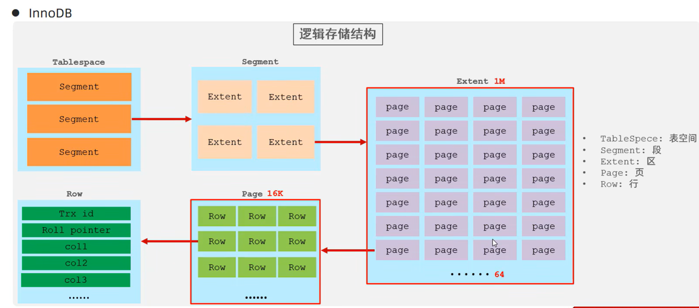

# MySQL体系结构
（mysql Server 分为4层：连接层、服务层、引擎层、存储层）

### 连接层
最上层是一些客户端和链接服务，主要完成一些类似于连接处理、授权认证、及相关的安全方案。服务器也会为安全接入的每个客户端验证它所具有的操作权限。


### 服务层
第二层架构主要完成大多数的核心服务功能，如SQL接口，并完成缓存的查询，SQL的分析和优化，部分内置函数的执行。所有跨存储引擎的功能也在这一层实现，如过程、函数等。


### 引擎层
存储引擎真正的负责了MySQL中数据的存储和提取，服务器通过API和存储引擎进行通信。不同的存储引擎具有不同的功能，这样我们可以根据自己的需要，来选取合适的存储引擎。


### 存储层
主要是将数据存储在文件系统之上，并完成与存储引擎的交互。

# 存储引擎简介
1. 在创建表时，指定存储引擎
```sql
CREATE TABLE 表名(
    字段1 字段1类型 [COMMENT 字段1注释],
    ......
    字段n 字段n类型 [COMMENT 字段n注释]
) ENGINE = INNODB [COMMENT 表注释];
```

2. 查看当前数据库支持的存储引擎
```sql
SHOW ENGINES;
```

# 存储引擎特点（InnoDB）
- **介绍**：InnoDB是兼顾高可靠性与高性能的通用存储引擎，MySQL 5.5之后成为默认存储引擎。
- **特点**：
  1. DML操作遵循ACID模型，支持事务；
  2. 采用行级锁，提升并发访问性能；
  3. 支持外键（FOREIGN KEY）约束，保障数据完整性与正确性。
- **文件**：
  - 对应文件为`xxx.ibd`（xxx为表名），存储表结构（frm、sdi）、数据及索引；
  - 关联参数：`innodb_file_per_table`。


# 存储引擎特点：MyISAM
### 介绍
MyISAM是MySQL早期版本的默认存储引擎，后被InnoDB替代。

### 特点
1. 功能限制：不支持事务与外键约束，数据一致性保障能力较弱；
2. 锁机制：仅支持表级锁，并发写操作时性能较低；
3. 优势：数据访问速度较快，适用于读密集、对事务无要求的场景（如静态数据展示）。

### 对应文件
MyISAM的表会生成3类文件（`xxx`为表名）：
- `xxx.sdi`：存储表结构信息；
- `xxx.MYD`：存储表的实际数据；
- `xxx.MYI`：存储表的索引信息。

# 存储引擎特点：Memory
### 介绍
Memory引擎的表数据存储于内存中，受硬件故障、断电等影响会丢失数据，因此仅适用于临时表或缓存场景。

### 特点
1. **存储介质**：数据完全存放于内存，访问速度极快；
2. **索引类型**：默认使用hash索引，适合等值查询场景。

### 对应文件
仅生成`xxx.sdi`文件（`xxx`为表名），用于存储表结构信息（数据存于内存，无独立数据/索引文件）。

# 存储引擎特点对比表

| 特点         | InnoDB                | MyISAM | Memory |
|--------------|-----------------------|--------|--------|
| 存储限制     | 64TB                  | 有     | 有     |
| 事务安全     | 支持                  | -      | -      |
| 锁机制       | 行锁                  | 表锁   | 表锁   |
| B+tree索引   | 支持                  | 支持   | 支持   |
| Hash索引     | -                     | -      | 支持   |
| 全文索引     | 支持（5.6版本之后）| 支持   | -      |
| 空间使用     | 高                    | 低     | N/A    |
| 内存使用     | 高                    | 低     | 中等   |
| 批量插入速度 | 低                    | 高     | 高     |
| 支持外键     | 支持                  | -      | -      |

# 存储引擎选择指南

### 1. InnoDB
- **定位**：MySQL默认存储引擎，支持事务、外键。
- **适用场景**：对事务完整性、数据一致性要求高，存在大量更新/删除操作的业务（如电商订单、金融交易）。


### 2. MyISAM
- **定位**：轻量引擎，不支持事务/外键。
- **适用场景**：以读操作、追加式插入为主，更新/删除极少，对并发和事务要求低的场景（如静态数据报表、日志存储）。


### 3. MEMORY
- **定位**：内存级存储，速度极快但数据易失。
- **适用场景**：临时表、缓存数据（如会话信息、临时计算结果），需注意表大小限制与数据安全性。


### 补充说明
复杂系统可组合使用多引擎（如核心业务用InnoDB，静态数据用MyISAM，临时缓存用MEMORY），同时实际开发中通常会弱化外键（避免耦合过高），转而在代码逻辑中保障数据关联完整性。