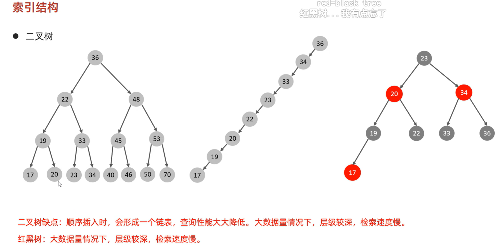
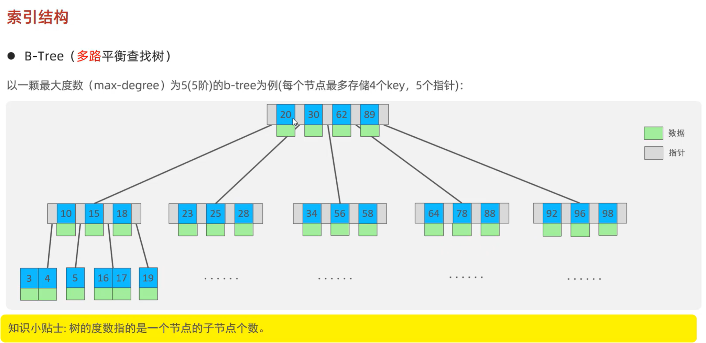
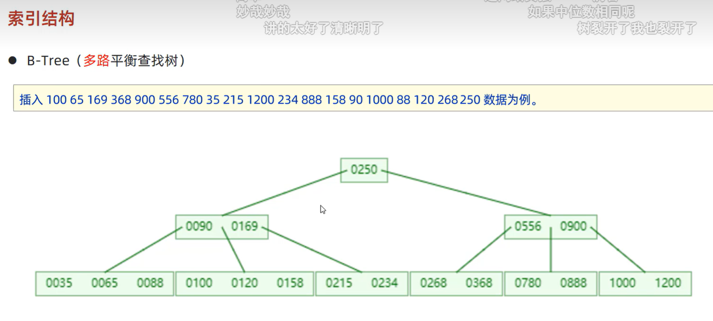
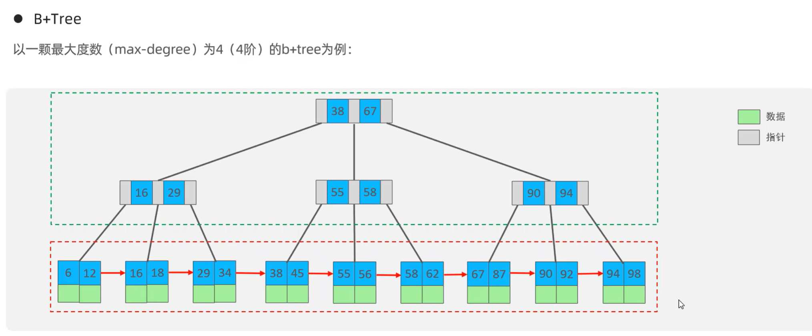
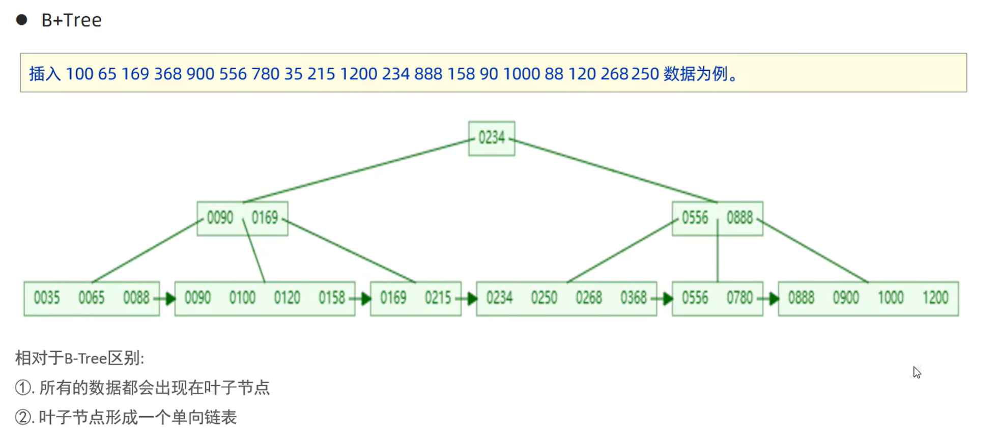
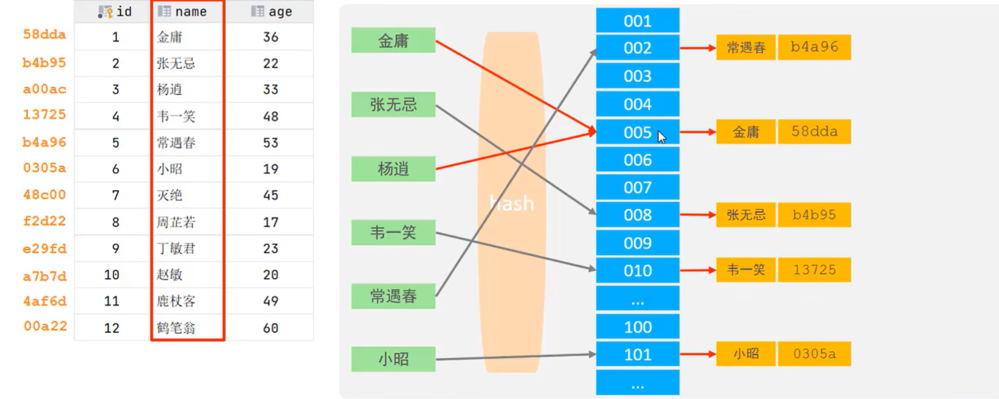
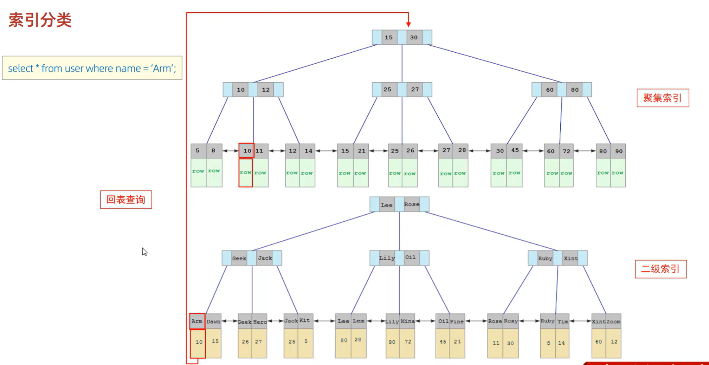

以下是优化排版后的 Markdown 版本（内容未修改，仅调整格式、加粗重点、优化列表/分隔线等）：


# MySQL 索引知识点总结


## 1. 索引概述

### 介绍
**索引 (Index)** 是帮助 MySQL **高效获取数据** 的 **数据结构 (有序)**。
在数据之外，数据库系统还维护着满足特定查找算法的数据结构，这些数据结构以某种方式引用（指向）数据，从而可以在这些结构上实现高级查找算法，这种数据结构就是索引。


### 优缺点对比
| **优势** | **劣势** |
|----------|----------|
| 提高数据检索效率，降低数据库 **IO 成本** | 索引列会 **占用存储空间** |
| 通过索引列排序数据，降低排序成本与 **CPU 消耗** | 降低表的更新速度（`INSERT`/`UPDATE`/`DELETE` 效率下降） |


---


## 2. 索引结构
MySQL 的索引在 **存储引擎层** 实现，不同存储引擎支持的结构不同，主要类型如下：

| **索引结构** | **描述** |
|--------------|----------|
| **B+Tree 索引** | 最常见的索引类型，大部分引擎支持 |
| **Hash 索引** | 底层为哈希表，仅支持精确匹配，不支持范围查询 |
| **R-tree (空间索引)** | MyISAM 特有的索引类型，用于地理空间数据，使用较少 |
| **Full-text (全文索引)** | 基于倒排索引实现文档快速匹配，类似 Lucene/Solr/ES |


---


## 3. 索引结构支持情况
不同存储引擎对索引结构的支持如下：

| **索引** | **InnoDB** | **MyISAM** | **Memory** |
|----------|------------|------------|------------|
| **B+tree 索引** | 支持 | 支持 | 支持 |
| **Hash 索引** | 不支持（但有自适应哈希索引） | 不支持 | 支持 |
| **R-tree 索引** | 不支持 | 支持 | 不支持 |
| **Full-text** | 5.6 版本后支持 | 支持 | 不支持 |


> **注意：** 虽然 InnoDB 不直接支持 Hash 索引，但它具备“自适应哈希索引”的内部优化功能。


---


# MySQL 索引结构深度解析


## 1. 二叉树与红黑树的局限性

### 二叉树 (Binary Tree)
- **缺点**：顺序插入数据时会形成单向链表，查询性能大幅降低。
- **大数据量问题**：数据量较大时树的层级过深，检索速度慢。


### 红黑树 (Red-Black Tree)
- **特点**：自平衡二叉树，避免退化为链表。
- **缺点**：大数据量下层级依然较深，检索速度相对较慢。





---


## 2. B-Tree（多路平衡查找树）
B-Tree 是专为外部存储设计的多路平衡查找树，可有效降低树的高度。


### 核心概念
- **树的度数 (Max-degree)**：一个节点最多拥有的子节点个数。
- **节点存储**（以 5 阶 B-Tree 为例）：
  - 每个节点最多存储 4 个 key；
  - 每个节点最多拥有 5 个指针。


### 结构示意
- 节点包含 **数据 (Data)** 和 **子节点指针**；
- 所有叶子节点位于同一层。





### B-Tree 插入示例
插入数据（如 `100 65 169 368 900 556 780 35 215 1200 234 888 158 90 1000 88 120 268 250`）时：
- 当节点 key 数量达到度数上限，节点会 **分裂**；
- 中间元素上移到父节点，保持树的平衡与低高度。





---


## 3. B+Tree 结构
B+Tree 是 MySQL 索引的核心实现基础，与 B-Tree 的主要区别：
1. **数据位置**：所有数据仅出现在叶子节点，非叶子节点仅存储键值和指针；
2. **叶子连接**：叶子节点形成单向链表（经典 B+Tree 结构）。






---


## 4. MySQL 优化的 B+Tree
MySQL 对经典 B+Tree 进一步优化，提升区间访问性能：
- **双向顺序指针**：叶子节点增加相邻节点的链表指针，形成双向循环链表；
- **页/块管理**：数据组织在页/块中，通过双向指针连接，大幅提高范围查询效率。


示意图.png)


---


# Hash 索引


## 1. 基本原理
哈希索引通过 **Hash 算法** 将键值换算为 **Hash 值**，映射到对应 **槽位** 并存储在 Hash 表中。
- **Hash 冲突**：多个键值映射到同一槽位时，通过 **链表** 解决。





---


## 2. Hash 索引特点
1. **查询限制**：仅支持 **等值比较**（`=`、`in`），不支持范围查询（`between`、`>`、`<` 等）；
2. **排序限制**：无法利用索引完成排序操作；
3. **查询效率**：通常一次检索即可定位数据，效率 **高于 B+Tree 索引**。


---


## 3. 存储引擎支持情况
- **Memory 引擎**：显式支持 Hash 索引；
- **InnoDB 引擎**：具有 **自适应 Hash (Adaptive Hash)** 功能，由存储引擎根据 B+Tree 索引自动构建，用户无法手动干预。


---


# 思考：为什么 InnoDB 存储引擎选择使用 B+Tree 索引结构？
通过与其他数据结构对比，B+Tree 在数据库索引场景下优势显著：


### 1. 相对于二叉树 (Binary Tree)
- **层级更少**：二叉树大数据量下层数深、检索慢；B+Tree 作为多路树，层级更少、效率更高；
- **性能稳定**：二叉树顺序插入会退化为链表；B+Tree 始终保持平衡。


### 2. 相对于 B-Tree
- **单页存储容量更大**：B-Tree 非叶子节点存数据，导致单页键值/指针数量少；
- **树的高度更低**：B-Tree 需增加高度存储大量数据，增加磁盘 IO；
- **B+Tree 优势**：非叶子节点仅存索引，树更“矮胖”；叶子节点双向指针大幅提升范围查询效率。


### 3. 相对于 Hash 索引
- **功能更全面**：Hash 索引不支持范围查询与排序；
- **灵活度高**：B+Tree 同时支持范围匹配与排序操作。


# 索引分类

## 1. 常规分类

根据索引的用途和约束，主要分为以下四类：

| 分类 | 含义 | 特点 | 关键字 |
| --- | --- | --- | --- |
| **主键索引** | 针对于表中主键创建的索引 | 默认自动创建，只能有一个 | PRIMARY |
| **唯一索引** | 避免同一个表中某数据列中的值重复 | 可以有多个 | UNIQUE |
| **常规索引** | 快速定位特定数据 | 可以有多个 |  |
| **全文索引** | 全文索引查找的是文本中的关键词，而不是比较索引中的值 | 可以有多个 | FULLTEXT |

---

## 2. InnoDB 存储形式分类

在 InnoDB 存储引擎中，根据索引的 **存储形式**，可以分为以下两种：

| 分类 | 含义 | 特点 |
| --- | --- | --- |
| **聚集索引** (Clustered Index) | 将数据存储与索引放到了一块，索引结构的叶子节点保存了行数据 | 必须有，而且只有一个 |
| **二级索引** (Secondary Index) | 将数据与索引分开存储，索引结构的叶子节点关联的是对应的主键 | 可以存在多个 |

### 聚集索引选取规则：

* 如果存在主键，**主键索引就是聚集索引**。
* 如果不存在主键，将使用 **第一个唯一 (UNIQUE) 索引** 作为聚集索引。
* 如果表没有主键，或没有合适的唯一索引，则 InnoDB 会自动生成一个 **rowid** 作为隐藏的聚集索引。




## 1. InnoDB 主键索引的 B+Tree 高度估算

### 假设条件：

* **数据页大小**：一页的大小通常为 **16k**。
* **单行记录**：假设一行数据大小为 **1k**，一页中可以存储 **16行** 这样的数据。
* **指针开销**：InnoDB 的指针占用 **6个字节** 的空间。
* **主键大小**：主键即使为 `bigint`，占用字节数也仅为 **8个字节**。

### 计算过程：

#### 高度为 2 时：

设  为非叶子节点中主键的数量，则有公式：


* **计算结果**：算出  约为 **1170**。
* **指针数量**：约为 **1171**。
* **总记录数**： 1171(页数) × 16(行数) = **18,736条数据**。

#### 高度为 3 时：

* **总记录数**： 1171 x 1171 x 16 = **21,939,856条数据**。

> **结论**：在 InnoDB 存储引擎中，高度为 3 的 B+Tree 索引即可支撑 **两千万级别** 的数据量存储。

---

## 2. SQL 语句执行效率案例分析

### 案例问题：

以下两条 SQL 语句，哪一个执行效率更高？为什么？

1. `select * from user where id = 10;`
2. `select * from user where name = 'Arm';`

**备注**：`id` 为主键，`name` 字段创建了常规索引。

### 解析：

**第一条语句（根据 ID 查询）执行效率更高。**

* **主键查询**：通过 `id` 查询直接走 **聚集索引**，聚集索引的叶子节点直接保存了完整的行记录数据，查询效率极高。
* **非主键查询**：通过 `name` 查询走的是 **二级索引**。二级索引的叶子节点只保存了对应的主键 ID。在查到 ID 后，还需要回到聚集索引中再次查找以获取完整行数据，这个过程被称为 **“回表查询”**，因此效率相对较低。

---

# 索引语法

## 1. 基础语法

通过 SQL 语句可以对数据库表的索引进行创建、查看和删除操作：

* **创建索引**
```sql
CREATE [ UNIQUE | FULLTEXT ] INDEX index_name ON table_name ( index_col_name,... );

```


* **查看索引**
```sql
SHOW INDEX FROM table_name ;

```


* **删除索引**
```sql
DROP INDEX index_name ON table_name ;

```


---

## 2. 案例实操

按照下列需求，完成索引的创建：

1. **name 字段为姓名字段，该字段的值可能会重复，为该字段创建索引。**
```sql
CREATE INDEX idx_user_name ON tb_user(name);

```


2. **phone 手机号字段的值，是非空且唯一的，为该字段创建唯一索引。**
```sql
CREATE UNIQUE INDEX idx_user_phone ON tb_user(phone);

```


3. **为 profession、age、status 创建联合索引。**
```sql
CREATE INDEX idx_user_pro_age_sta ON tb_user(profession,age,status);

```


4. **为 email 建立合适的索引来提升查询效率。**
```sql
CREATE INDEX idx_email ON tb_user(email);

```


# SQL 性能分析

## 1. SQL 执行频率

MySQL 客户端连接成功后，通过 `show [session|global] status` 命令可以提供服务器状态信息。通过如下指令，可以查看当前数据库的 **INSERT、UPDATE、DELETE、SELECT** 的访问频次：

```sql
SHOW GLOBAL STATUS LIKE 'Com_______';

```

## 2. 慢查询日志

**慢查询日志**记录了所有执行时间超过指定参数（`long_query_time`，单位：秒，默认 10 秒）的所有 SQL 语句的日志。

MySQL 的慢查询日志默认没有开启，需要在 MySQL 的配置文件（`/etc/my.cnf`）中配置如下信息：

```ini
# 开启 MySQL 慢日志查询开关
slow_query_log=1

# 设置慢日志的时间为 2 秒，SQL 语句执行时间超过 2 秒，就会视为慢查询，记录慢查询日志
long_query_time=2

```

配置完毕之后，通过以下指令重新启动 MySQL 服务器进行测试，查看慢日志文件中记录的信息：`/var/lib/mysql/localhost-slow.log`。

根据您上传的最后两张图片，我为您整理了关于 **SQL 性能分析——profile 详情** 的 Markdown 笔记：

## 3. profile 详情

`show profiles` 能够在做 SQL 优化时帮助我们了解时间都耗费到哪里去了。通过 `have_profiling` 参数，能够看到当前 MySQL 是否支持 profile 操作：

```sql
SELECT @@have_profiling ;

```

默认 profiling 是关闭的，可以通过 `set` 语句在 `session/global` 级别开启 profiling：

```sql
SET profiling = 1;

```

---

执行一系列的业务 SQL 的操作，然后通过如下指令查看指令的执行耗时：

* **查看每一条 SQL 的耗时基本情况**
```sql
show profiles;

```


* **查看指定 `query_id` 的 SQL 语句各个阶段的耗时情况**
```sql
show profile for query query_id;

```


* **查看指定 `query_id` 的 SQL 语句 CPU 的使用情况**
```sql
show profile cpu for query query_id;

```

## 4. EXPLAIN 执行计划

使用 `EXPLAIN` 或 `DESC` 命令可以获取 MySQL 如何执行 `SELECT` 语句的信息，包括在 `SELECT` 语句执行过程中表如何连接以及连接的顺序。

### 4.1 语法

在 `SELECT` 语句之前加上关键字 `explain` 或 `desc`：

```sql
# 直接在 select 语句之前加上关键字 explain / desc
EXPLAIN SELECT 字段列表 FROM 表名 WHERE 条件;

```

### 4.2. EXPLAIN 执行计划各字段含义

通过执行计划的结果，我们可以通过以下核心字段来分析 SQL 的性能：

| 字段名 | 含义解析 |
| --- | --- |
| **id** | `SELECT` 查询的序列号。表示查询中执行 `SELECT` 子句或者是操作表的顺序。**id相同**：执行顺序从上到下；**id不同**：值越大，越先执行。 |
| **select_type** | 表示 `SELECT` 的类型。常见取值有 `SIMPLE`（简单表，不使用表连接或者子查询）、`PRIMARY`（主查询，即外层的查询）、`UNION`、`SUBQUERY` 等。 |
| **type** | **核心指标**。表示连接类型，性能由好到差依次为：`NULL`、`system`、`const`、`eq_ref`、`ref`、`range`、`index`、`all`。 |
| **possible_key** | 显示可能应用在这张表上的索引，一个或多个。 |
| **key** | **实际使用的索引**。如果为 `NULL`，则没有使用索引。 |
| **key_len** | 表示索引中使用的字节数。该值为索引字段最大可能长度，并非实际使用长度。在不损失精确性的前提下，长度越短越好。 |
| **rows** | MySQL 认为它执行查询时必须检查的行数。在 InnoDB 引擎中是一个估计值，不总是准确的。 |
| **filtered** | 表示返回结果的行数占需读取行数的百分比。`filtered` 的值越大越好。 |

### **`type`** 具体类型详解 

#### 1. NULL

* **含义**：MySQL 在优化阶段分解查询语句，执行时甚至不需要访问表或索引。
* **场景**：通常出现在查询一些简单的常量值或聚合函数且不涉及数据行时。

#### 2. system

* **含义**：表只有一行记录（等于系统表），这是 `const` 连接类型的特例，性能极高。
* **场景**：查询系统内置表或数据量极小的单行表。

#### 3. const

* **含义**：通过索引一次就找到了数据。
* **场景**：通常用于比较 **主键 (Primary Key)** 或 **唯一索引 (Unique Index)**。因为只有一行匹配，所以 MySQL 能将其视为常量。

#### 4. eq_ref

* **含义**：唯一性索引扫描。
* **场景**：对于每个索引键，表中只有一条记录与之匹配。常见于多表连接查询中使用主键或唯一索引作为连接条件。

#### 5. ref

* **含义**：非唯一性索引扫描。
* **场景**：返回所有匹配某个单独值的行。常见于使用 **常规索引**（非唯一索引）进行等值查询。

#### 6. range

* **含义**：范围扫描。
* **场景**：只检索给定范围的行，使用索引来选择行。通常出现在 `BETWEEN`、`>`、`<`、`IN` 等范围查询中。

#### 7. index

* **含义**：全索引扫描。
* **场景**：MySQL 遍历整个索引树来查找数据，这通常比全表扫描（All）稍快一点，因为索引文件通常比数据文件小。

#### 8. all

* **含义**：**全表扫描**。
* **场景**：MySQL 将遍历全表以找到匹配的行。这是性能最差的一种情况，通常意味着没有建立合适的索引或索引失效。

根据您上传的图片，我为您整理了关于**联合索引使用规则（最左前缀法则与范围查询）**的详细 Markdown 笔记：


# 索引使用

## 1. 最左前缀法则

如果索引了多列（联合索引），要遵守 **最左前缀法则**。最左前缀法则指的是查询从索引的最左列开始，并且不跳过索引中的列。

* **完全生效**：如果按照索引建立的顺序从左到右依次查询，索引将完全生效。
* **部分失效**：如果跳跃某一个列，**索引将部分失效**（跳过列后面的字段索引失效）。
* **完全失效**：如果查询条件中不包含索引的最左列，则索引完全失效。

### 案例分析（假设联合索引为：profession, age, status）

| 查询条件 | 索引生效情况 |
| --- | --- |
| `where profession = '软件工程' and age = 31 and status = '0'` | 索引全部生效 |
| `where profession = '软件工程' and age = 31` | 索引生效（前两列） |
| `where profession = '软件工程'` | 索引生效（第一列） |
| `where age = 31 and status = '0'` | **索引完全失效**（缺失最左列 profession） |
| `where status = '0'` | **索引完全失效**（缺失最左列 profession） |

---

## 2. 范围查询

在联合索引中，出现范围查询（`>`，`<`），**范围查询右侧的列索引失效**。

### 案例分析

* **情况一：索引失效**
```sql
explain select * from tb_user where profession = '软件工程' and age > 30 and status = '0';

```


> **结果**：由于使用了 `age > 30`，其右侧的 `status` 字段将无法利用索引。


* **情况二：规避失效**
```sql
explain select * from tb_user where profession = '软件工程' and age >= 30 and status = '0';

```

> **提示**：在业务允许的情况下，尽量使用 `>=` 或 `<=`，这样可以使索引覆盖到该字段并包含右侧字段。

## 索引失效情况

### 1. 索引列运算

**不要在索引列上进行任何运算操作，否则索引将失效。**

* **失效案例**：
```sql
-- 即使 phone 字段有索引，使用 substring 函数后索引也会失效
explain select * from tb_user where substring(phone,10,2) = '15';

```


---

### 2. 字符串不加引号

**字符串类型的字段在查询时，如果不加单引号，索引将失效。**

* **失效案例**：
```sql
-- 假设 profession 和 phone 是字符串类型
explain select * from tb_user where profession = '软件工程' and age = 31 and status = 0; -- status 没加引号导致索引失效
explain select * from tb_user where phone = 17799990015; -- phone 没加引号导致索引失效

```


---

### 3. 模糊查询 (LIKE)

**模糊查询中，通配符的位置决定了索引是否失效。**

* **尾部模糊匹配**：索引**不会失效**。
```sql
explain select * from tb_user where profession like '软件%'; -- 索引有效

```


* **头部模糊匹配**：索引**将失效**。
```sql
explain select * from tb_user where profession like '%工程'; -- 索引失效
explain select * from tb_user where profession like '%工%'; -- 索引失效

```

### 4. or 连接的条件

用 `or` 分割开的条件，如果 `or` 前面的列有索引，而后面的列中没有索引，那么涉及的索引都**不会被用到**。

* **失效案例分析**：
```sql
-- 即使 id 和 phone 有索引，但由于 age 没有索引，整个查询都不会走索引
explain select * from tb_user where id = 10 or age = 23;
explain select * from tb_user where phone = '17799990017' or age = 23;

```


* **解决建议**：需要针对 `or` 后面的列（如上述案例中的 `age`）也建立索引，才能使整体查询效率提升。

---

### 5. 数据分布影响

MySQL 在执行查询前会进行成本评估。**如果 MySQL 评估使用索引比全表扫描更慢，则不使用索引**。

* **典型场景**：
当查询条件覆盖了表中绝大多数数据时（例如查询大于某个较小值的手机号），MySQL 认为回表查询的开销大于直接全表扫描，此时会放弃索引。
* **案例演示**：
```sql
-- 假设 phone 字段有索引
select * from tb_user where phone >= '17799990005'; -- 若数据量极大，可能不走索引
select * from tb_user where phone >= '17799990015'; -- 若匹配行数极少，可能走索引

```


## SQL 提示

**SQL 提示**是优化数据库的一个重要手段。简单来说，就是在 SQL 语句中加入一些人为人为的提示来达到优化操作的目的。通过这种方式，我们可以直接告诉 MySQL 优化器应该“建议”、“忽略”还是“强制”使用哪个索引。

### 1. use index (建议使用)

向优化器推荐使用某个特定索引，但优化器最终仍会根据成本评估决定是否采纳。

```sql
explain select * from tb_user use index(idx_user_pro) where profession = '软件工程';

```

### 2. ignore index (忽略索引)

明确告诉优化器在执行查询时忽略某个特定索引。

```sql
explain select * from tb_user ignore index(idx_user_pro) where profession = '软件工程';

```

### 3. force index (强制使用)

强制要求优化器必须使用该索引，即使优化器认为全表扫描可能更快（除非该索引物理上无法完成查询）。

```sql
explain select * from tb_user force index(idx_user_pro) where profession = '软件工程';

```

根据您上传的最后两张图片，我为您整理了关于 **索引使用——覆盖索引** 的 Markdown 笔记：


## 覆盖索引

在 SQL 优化中，应尽量使用 **覆盖索引**。覆盖索引是指查询使用了索引，并且需要返回的列在该索引中已经全部能够找到，从而减少 `SELECT *` 的使用。

### 案例分析（假设存在联合索引：profession, age, status）

执行以下 SQL 并观察 `Extra` 字段提示：

```sql
-- 1. 性能最高：直接从索引中获取 id 和 profession
explain select id, profession from tb_user where profession = '软件工程' and age = 31 and status = '0';

-- 2. 性能高：索引覆盖了所有返回字段
explain select id, profession, age, status from tb_user where profession = '软件工程' and age = 31 and status = '0';

-- 3. 性能较低：name 字段不在索引中，需要回表查询
explain select id, profession, age, status, name from tb_user where profession = '软件工程' and age = 31 and status = '0';

-- 4. 不推荐：使用 select * 极易导致回表查询
explain select * from tb_user where profession = '软件工程' and age = 31 and status = '0';

```

#### 💡 知识小贴士：

* **using index condition**：查找使用了索引，但是需要**回表查询**数据。
* **using where; using index**：查找使用了索引，且需要的数据都在索引列中能找到，所以**不需要回表查询**数据，效率最高。

---

### 思考题：最优方案分析

**题目背景**：一张表有四个字段 (`id`, `username`, `password`, `status`)。由于数据量大，需要对以下 SQL 语句进行优化：

```sql
select id, username, password from tb_user where username = 'itcast';

```

**最优方案解析**：
为了达到最优性能，应建立 **`(username, password)` 的联合索引**。

* **原因**：建立此联合索引后，查询条件 `username` 可以走索引定位。同时，由于 `id` 是主键（二级索引叶子节点默认携带主键值），`username` 和 `password` 都在索引树上，整个查询满足**覆盖索引**，无需回表，性能达到最优。

根据您上传的图片内容，我为您整理了关于 **前缀索引** 的 Markdown 笔记：


## 前缀索引

当字段类型为字符串（`varchar`，`text` 等）时，有时候需要索引很长的字符串，这会让索引变得很大，查询时浪费大量的磁盘 IO，影响查询效率。此时可以只将字符串的一部分前缀建立索引，这样可以大大节约索引空间，从而提高索引效率。

### 1. 语法

```sql
create index idx_xxxx on table_name(column(n));

```

*注：其中 `n` 代表截取的字符串前缀长度。*

---

### 2. 前缀长度的选择

前缀长度可以根据 **索引的选择性** 来决定。选择性是指不重复的索引值（基数）和数据表记录总数的比值。

* **规则**：索引选择性越高则查询效率越高。
* **最佳状态**：唯一索引的选择性是 **1**，这是最好的索引选择性，性能也是最好的。

#### 计算选择性的公式：

可以通过如下 SQL 语句来评估不同长度下的选择性，从而确定最佳截取长度：

```sql
-- 计算完整列的选择性
select count(distinct email) / count(*) from tb_user;

-- 计算截取前 5 位字符时的选择性
select count(distinct substring(email,1,5)) / count(*) from tb_user;

-- 计算截取前 10 位字符时的选择性（对应图片中的操作）
select count(distinct substring(email,1,10)) / count(*) from tb_user;

```
