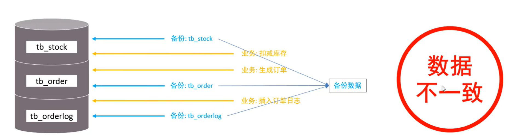

# 概述

## ● 介绍

锁是计算机协调多个进程或线程并发访问某一资源的机制。在数据库中，除传统的计算资源（CPU、RAM、I/O）的争用以外，数据也是一种供许多用户共享的资源。如何保证数据并发访问的一致性、有效性是所有数据库必须解决的一个问题，锁冲突也是影响数据库并发访问性能的一个重要因素。从这个角度来说，锁对数据库而言显得尤其重要，也更加复杂。

---

## ● 分类

MySQL 中的锁，按照锁的粒度分，分为以下三类：

1. **全局锁**：锁定数据库中的所有表。
2. **表级锁**：每次操作锁定整张表。
3. **行级锁**：每次操作锁定对应的行数据。

# 全局锁

## ● 介绍

全局锁就是对整个数据库实例加锁。 加锁后整个实例就处于**只读状态**，后续的 DML 的写语句，DDL 语句，已经更新操作的事务提交语句都将被阻塞。

其典型的使用场景是做**全库的逻辑备份**，对所有的表进行锁定，从而获取一致性视图，保证数据的完整性。

> **注意**：如果不加全局锁进行备份，在并发写入的情况下（如：扣减库存、生成订单、插入日志同时发生），可能会导致备份的数据在时间点上不一致，产生“数据不一致”的问题。

---

## ● 演示 - 加全局锁

全局锁的操作主要涉及加锁、数据导出和解锁三个步骤：

### 1. 加全局读锁

在执行备份前，先执行以下 SQL 语句锁定数据库：

```sql
flush tables with read lock ;

```

### 2. 执行数据备份

使用 `mysqldump` 工具将数据库导出为 SQL 文件：

```bash
mysqldump -uroot -p1234 itcast > itcast.sql

```

* **DML / DDL**：在锁定期间，这些操作将被阻塞。
* **DQL**：查询操作（如 `SELECT`）可以正常进行。

### 3. 释放锁

备份完成后，执行以下语句解锁，使数据库恢复正常读写：

```sql
unlock tables ;

```

## 演示 - 不加全局锁的问题


根据您提供的三张关于 **全局锁** 的图片，以下是整理后的 Markdown 内容：

---

## ● 特点

数据库中加全局锁是一个比较重的操作，存在以下问题：

1. **如果在主库上备份**：备份期间不能执行更新，业务基本上就得停摆。
2. **如果在从库上备份**：备份期间从库不能执行主库同步过来的二进制日志（binlog），会导致主从延迟。

**优化方案**：
在 **InnoDB** 引擎中，我们可以在备份时加上参数 `--single-transaction` 来完成不加锁的一致性数据备份。

```bash
mysqldump --single-transaction -uroot -p123456 itcast > itcast.sql

```

# 表级锁

## ● 介绍

表级锁，每次操作锁住整张表。锁定粒度大，发生锁冲突的概率最高，并发度最低。应用在 MyISAM、InnoDB、BDB 等存储引擎中。

对于表级锁，主要分为以下三类：

1. **表锁**
2. **元数据锁（meta data lock, MDL）**
3. **意向锁**

---

## ● 表锁

对于表锁，分为两类：

1. **表共享读锁（read lock）**
2. **表独占写锁（write lock）**

### 语法：

1. **加锁**：`lock tables 表名... read/write`。
2. **释放锁**：`unlock tables` / 客户端断开连接。

### 锁特征说明：

* **读锁（read lock）**：不会阻塞其他客户端的读，但是会阻塞写。
* **写锁（write lock）**：既会阻塞其他客户端的读，又会阻塞其他客户端的写。

## ● 元数据锁 (meta data lock, MDL)

MDL 加锁过程是系统自动控制，无需显式使用，在访问一张表的时候会自动加上。MDL 锁主要作用是维护表元数据的数据一致性，在表上有活动事务的时候，不可以对元数据进行写入操作。**为了避免 DML 与 DDL 冲突，保证读写的正确性**。

在 MySQL 5.5 中引入了 MDL，当对一张表进行增删改查的时候，加 MDL 读锁（共享）；当对表结构进行变更操作的时候，加 MDL 写锁（排他）。

| 对应 SQL | 锁类型 | 说明 |
| --- | --- | --- |
| `lock tables xxx read / write` | SHARED_READ_ONLY / SHARED_NO_READ_WRITE |  |
| `select`、`select ... lock in share mode` | SHARED_READ | 与 SHARED_READ、SHARED_WRITE 兼容，与 EXCLUSIVE 互斥 |
| `insert`、`update`、`delete`、`select ... for update` | SHARED_WRITE | 与 SHARED_READ、SHARED_WRITE 兼容，与 EXCLUSIVE 互斥 |
| `alter table ...` | EXCLUSIVE | 与其他的 MDL 都互斥 |

**查看元数据锁：**

```sql
select object_type,object_schema,object_name,lock_type,lock_duration from performance_schema.metadata_locks;

```

## ● 意向锁

1. **意向共享锁 (IS)**：与表锁共享锁 (read) 兼容，与表锁排它锁 (write) 互斥。
2. **意向排他锁 (IX)**：与表锁共享锁 (read) 及排它锁 (write) 都互斥。意向锁之间不会互斥。

**可以通过以下 SQL，查看意向锁及行锁的加锁情况：**

```sql
select object_schema,object_name,index_name,lock_type,lock_mode,lock_data from performance_schema.data_locks;

```

# 行级锁

## ● 介绍

行级锁，每次操作锁住对应的行数据。锁定粒度最小，发生锁冲突的概率最低，并发度最高。应用在 **InnoDB** 存储引擎中。

InnoDB 的数据是基于索引组织的，**行锁是通过对索引上的索引项加锁来实现的，而不是对记录加的锁**。对于行级锁，主要分为以下三类：

1. **行锁（Record Lock）**：锁定单个行记录的锁，防止其他事务对此行进行 `update` 和 `delete`。在 RC、RR 隔离级别下都支持。
2. **间隙锁（Gap Lock）**：锁定索引记录间隙（不含该记录），确保索引记录间隙不变，防止其他事务在这个间隙进行 `insert`，产生幻读。在 RR 隔离级别下支持。
3. **临键锁（Next-Key Lock）**：行锁和间隙锁组合，同时锁住数据，并锁住数据前面的间隙 Gap。在 RR 隔离级别下支持。

## ● 行锁

InnoDB 实现了以下两种类型的行锁：

1. **共享锁 (S)**：允许一个事务去读一行，阻止其他事务获得相同数据集的排它锁。
2. **排他锁 (X)**：允许获取排他锁的事务更新数据，阻止其他事务获得相同数据集的共享锁和排他锁。

**兼容性表：**

| 当前锁类型 \ 请求锁类型 | S (共享锁) | X (排他锁) |
| --- | --- | --- |
| **S (共享锁)** | **兼容** | 冲突 |
| **X (排他锁)** | 冲突 | 冲突 |

---

### ● SQL 语句与行锁类型

常见的 SQL 语句在执行时加锁情况如下：

| SQL | 行锁类型 | 说明 |
| --- | --- | --- |
| `INSERT ...` | **排他锁** | 自动加锁 |
| `UPDATE ...` | **排他锁** | 自动加锁 |
| `DELETE ...` | **排他锁** | 自动加锁 |
| `SELECT (正常)` | **不加任何锁** |  |
| `SELECT ... LOCK IN SHARE MODE` | **共享锁** | 需要手动在 SELECT 之后添加 |
| `SELECT ... FOR UPDATE` | **排他锁** | 需要手动在 SELECT 之后添加 |

---

### ● 行锁-演示

默认情况下，InnoDB 在 **REPEATABLE READ** 事务隔离级别运行，InnoDB 使用 **next-key** 锁进行搜索和索引扫描，以防止幻读。

1. 针对**唯一索引**进行检索时，对已存在的记录进行等值匹配时，将会自动优化为**行锁**。
2. InnoDB 的行锁是针对索引加的锁，**不通过索引条件检索数据，那么 InnoDB 将对表中的所有记录加锁，此时就会升级为表锁**。

**查看意向锁及行锁加锁情况：**

```sql
select object_schema,object_name,index_name,lock_type,lock_mode,lock_data from performance_schema.data_locks;

```

## 间隙锁/临键锁演示

### 1. 核心背景

默认情况下，InnoDB 存储引擎在 **REPEATABLE READ (可重复读)** 事务隔离级别下运行。InnoDB 使用 **Next-key Lock (临键锁)** 进行搜索和索引扫描，以此来防止**幻读**。

### 2. 锁退化/优化规则

在不同的查询场景下，Next-key Lock 会根据索引类型和查询条件发生退化：

1. **索引上的等值查询（唯一索引）**：
* 当给**不存在**的记录加锁时，Next-key Lock 优化为 **Gap Lock (间隙锁)**。


2. **索引上的等值查询（普通索引）**：
* 向右遍历时，如果最后一个值不满足查询需求，Next-key Lock 会退化为 **Gap Lock (间隙锁)**。


3. **索引上的范围查询（唯一索引）**：
* 会持续访问到不满足条件的第一个值为止。


### 3. 注意事项

> **注意**：间隙锁唯一的目的是**防止其他事务在间隙中插入数据**。
> * 间隙锁可以**共存**。
> * 一个事务采用的间隙锁不会阻止另一个事务在同一间隙上采用间隙锁。
> 
> 
