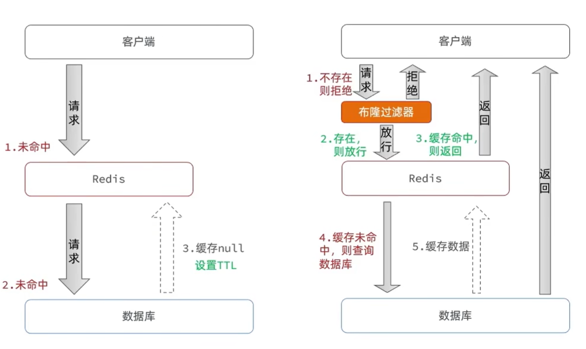
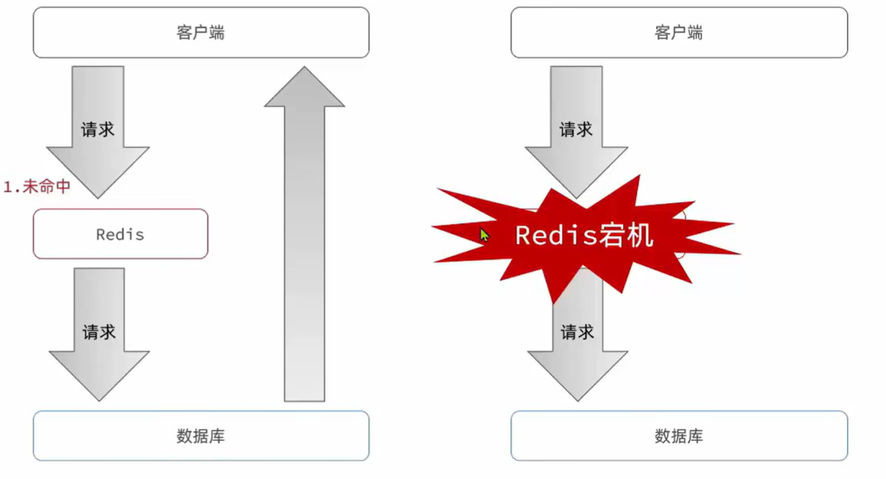
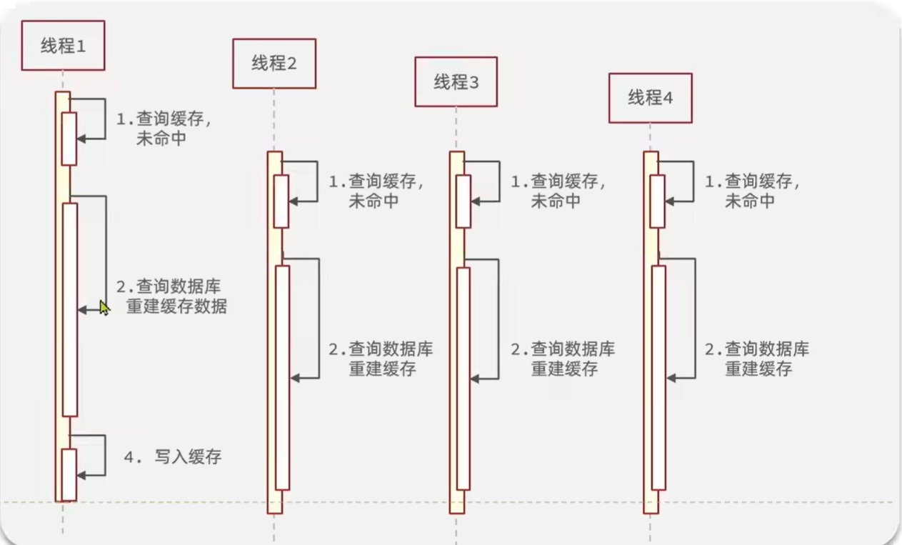
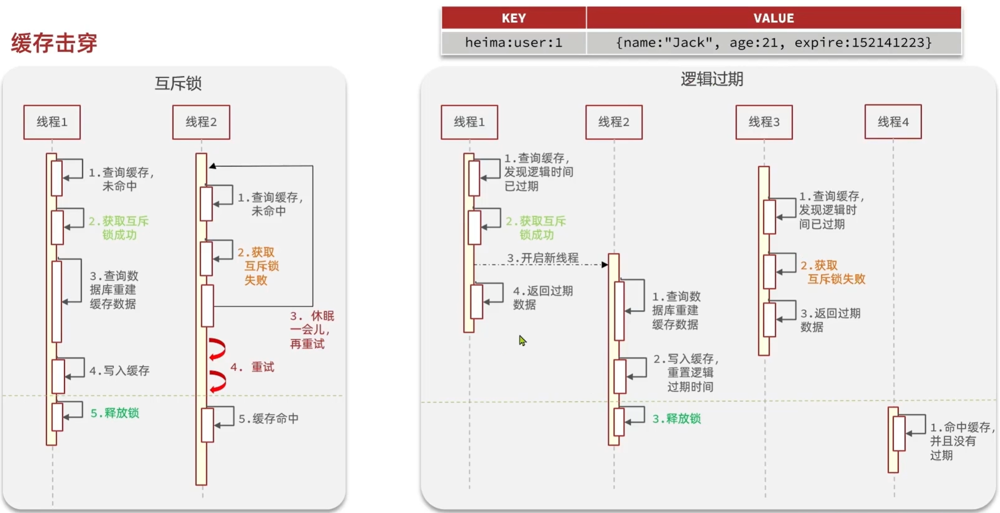

# 缓存更新策略学习笔记

## 1. 缓存更新策略对比

| 策略 | 内存淘汰 | 超时剔除 | 主动更新 |
| --- | --- | --- | --- |
| **说明** | 不用自己维护，利用 Redis 的内存淘汰机制，当内存不足时自动淘汰部分数据。下次查询时更新缓存。 | 给缓存数据添加 TTL 时间，到期后自动删除缓存。下次查询时更新缓存。 | 编写业务逻辑，在修改数据库的同时，更新缓存。 |
| **一致性** | 差 | 一般 | 好 |
| **维护成本** | 无 | 低 | 高 |

**业务场景选择：**

* **低一致性需求**：使用内容淘汰机制。例如店铺类型的查询缓存。
* **高一致性需求**：主动更新，并以超时剔除作为兜底方案。例如店铺详情查询的缓存。

---

## 2. 主动更新的三种模式

根据缓存调用者的不同，主动更新分为以下三种模式：

1. **Cache Aside Pattern (旁路缓存模式)**：由缓存的调用者，在更新数据库的同时更新缓存。这是目前应用最广泛的模式。
2. **Read/Write Through Pattern**：缓存与数据库整合为一个服务，由服务来维护一致性。调用者只需调用该服务，无需关心缓存一致性问题。
3. **Write Behind Caching Pattern**：调用者只操作缓存，由其它线程异步地将缓存数据持久化到数据库，保证最终一致性。

---

## 3. Cache Aside 最佳实践方案

在操作缓存和数据库时，需要考虑以下三个核心问题：

### 问题一：删除缓存还是更新缓存？

* **更新缓存**：每次更新数据库都更新缓存，无效写操作较多（**不推荐**）。
* **删除缓存**：更新数据库时让缓存失效，查询时再更新缓存（**推荐**）。

### 问题二：如何保证操作的原子性？

* **单体系统**：将缓存与数据库操作放在一个事务中。
* **分布式系统**：利用 TCC 等分布式事务方案。

### 问题三：先操作缓存还是先操作数据库？

* **方案 A：先删除缓存，再操作数据库**。
* **方案 B：先操作数据库，再删除缓存**（**推荐，发生概率更低**）。

---

## 4. 最终实践方案总结

### 场景一：低一致性需求

* 使用 Redis 自带的**内存淘汰机制**。

### 场景二：高一致性需求

采用**主动更新**，并以**超时剔除**作为兜底方案：

* **读操作**：
* 缓存命中则直接返回。
* 缓存未命中则查询数据库，并写入缓存，**设定超时时间**。

* **写操作**：
* **先写数据库，然后再删除缓存**。
* 要确保数据库与缓存操作的**原子性**。

根据您上传的最后一张图片内容（文件名：image_701702.jpg），我为您整理了对应的 Markdown 笔记：

---

# 缓存穿透 (Cache Penetration)

**定义：** 缓存穿透是指客户端请求的数据在缓存中和数据库中都**不存在**，这样缓存永远不会生效，这些请求都会打到数据库上。

## 常见的解决方案

### 1. 缓存空对象

* **优点：** 实现简单，维护方便。
* **缺点：**
* 额外的内存消耗。
* 可能造成短期的不一致。

### 2. 布隆过滤 (Bloom Filter)

* **优点：** 内存占用较少，没有多余 key。
* **缺点：**
* 实现复杂。
* 存在误判可能。

### 3. 其他增强防御方案
* **增强 ID 的复杂度：** 避免使用简单的自增 ID，防止攻击者轻易猜测出 ID 的规律进行暴力遍历。

* **做好数据的基础格式校验：** 在进入业务逻辑前，对请求参数进行严格校验（如长度、格式、类型），直接拦截非法请求。

* **加强用户权限校验：** 对每个请求进行权限校验，确保只有合法用户才能访问。

* **做好热点参数的限流：** 对热点参数进行限流，防止恶意请求对数据库造成压力。

---

## 流程图解

### 方案一：缓存空对象流程

1. **请求数据**：客户端发起请求。
2. **未命中缓存**：Redis 检查发现不存在。
3. **查询数据库**：数据库查询后发现也**不存在**该数据。
4. **缓存空值**：将 `null` 写入 Redis，并设置一个较短的 **TTL**。

### 方案二：布隆过滤流程

1. **客户端请求**：进入布隆过滤器。
2. **过滤器拦截**：
* 如果过滤器判断**不存在**，则直接拒绝请求。
* 如果过滤器判断**存在**，则放行进入下层。

3. **查询 Redis**：缓存命中则返回；未命中则查数据库。
4. **查询数据库**：若数据库有数据，则回写缓存并返回。

# 缓存雪崩 (Cache Avalanche)

**缓存雪崩**是指在同一时段大量的缓存 Key 同时失效，或者 Redis 服务宕机，导致大量请求直接到达数据库，给数据库带来巨大压力，甚至导致数据库崩溃。

### 解决方案：

* **给不同的 Key 的 TTL (过期时间) 添加随机值**：避免大量 Key 在同一时刻集中失效。
* **利用 Redis 集群提高服务的可用性**：通过主从复制、哨兵模式或 Cluster 集群防止单点故障。
* **给缓存业务添加降级限流策略**：在流量激增时限制请求量，或返回默认降级数据，保护数据库。
* **给业务添加多级缓存**：例如利用本地缓存 (Guava/Caffeine) 作为一级缓存，Redis 作为二级缓存。

# 缓存击穿 (Cache Breakdown) 详解

## 1. 定义与场景

**缓存击穿**问题也叫 **热点 Key 问题**。
当一个被**高并发访问**且**缓存重建业务较复杂**的 Key 突然失效时，无数的请求会在瞬间给数据库带来巨大的冲击。

---

## 2. 解决方案对比

| 解决方案 | 优点 | 缺点 |
| --- | --- | --- |
| **互斥锁** | - 没有额外的内存消耗 - 保证一致性 - 实现简单 | - 线程需要等待，性能受影响 - 可能有死锁风险 |
| **逻辑过期** | - 线程无需等待，性能较好 | - 不保证一致性 - 有额外内存消耗 - 实现复杂 |

## 3. 执行流程原理图

### A. 互斥锁方案 (Mutex Lock)

通过锁机制保证只有一个线程去查询数据库并重建缓存。

1. **线程 1**：查询缓存未命中 -> 获取互斥锁成功 -> 查询数据库并重建缓存数据 -> 将数据写入缓存 -> 释放锁。
2. **线程 2**：查询缓存未命中 -> 获取互斥锁失败 -> 休眠一会儿并重试 -> 缓存命中（此时线程 1 已完成重建）。

### B. 逻辑过期方案 (Logical Expiration)

不设置 Redis 的物理 TTL，而是将过期时间存放在数据 Value 中。

1. **线程 1**：查询缓存，发现逻辑时间已过期 -> 获取互斥锁成功 -> **开启新线程**异步重建数据 -> 线程 1 立即返回过期的旧数据。
2. **新线程**：查询数据库并重建数据 -> 重置逻辑过期时间 -> 写入缓存 -> 释放锁。
3. **线程 3**：在重建期间获取锁失败，不等待，直接返回过期的旧数据。
4. **线程 4**：在重建完成后访问，直接命中缓存且发现未过期。

