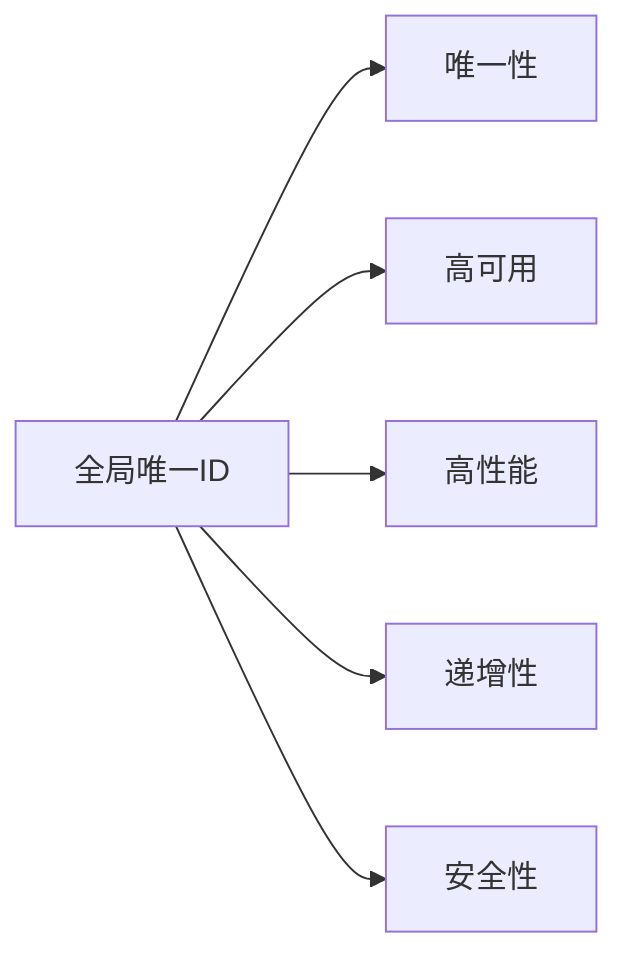
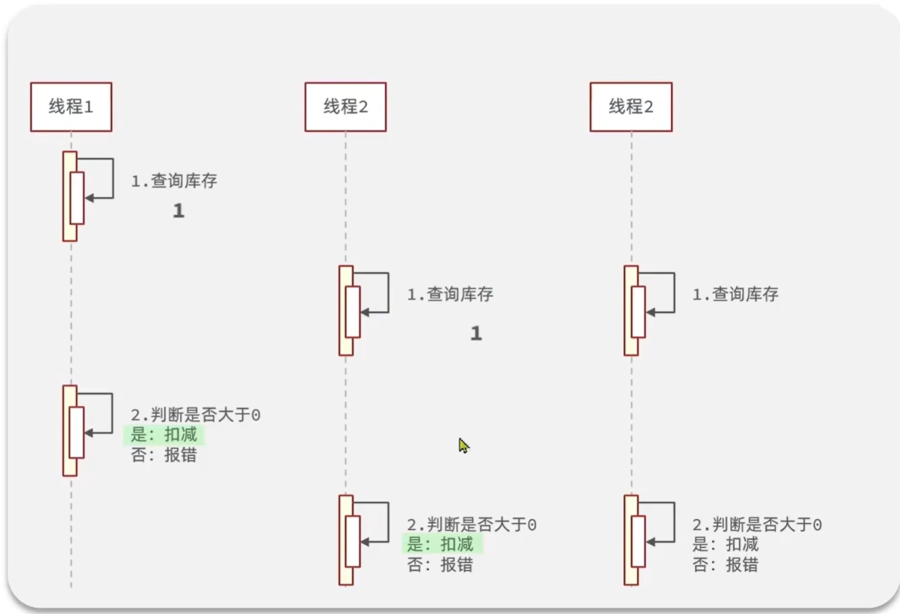
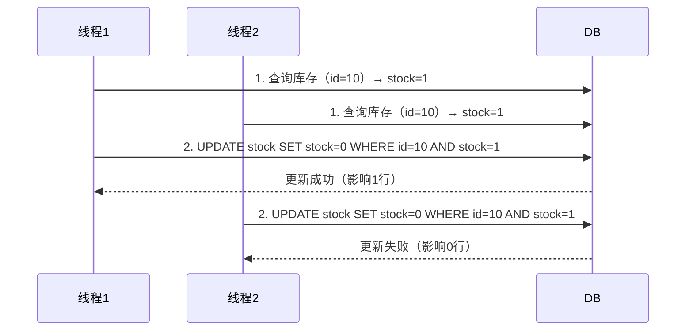
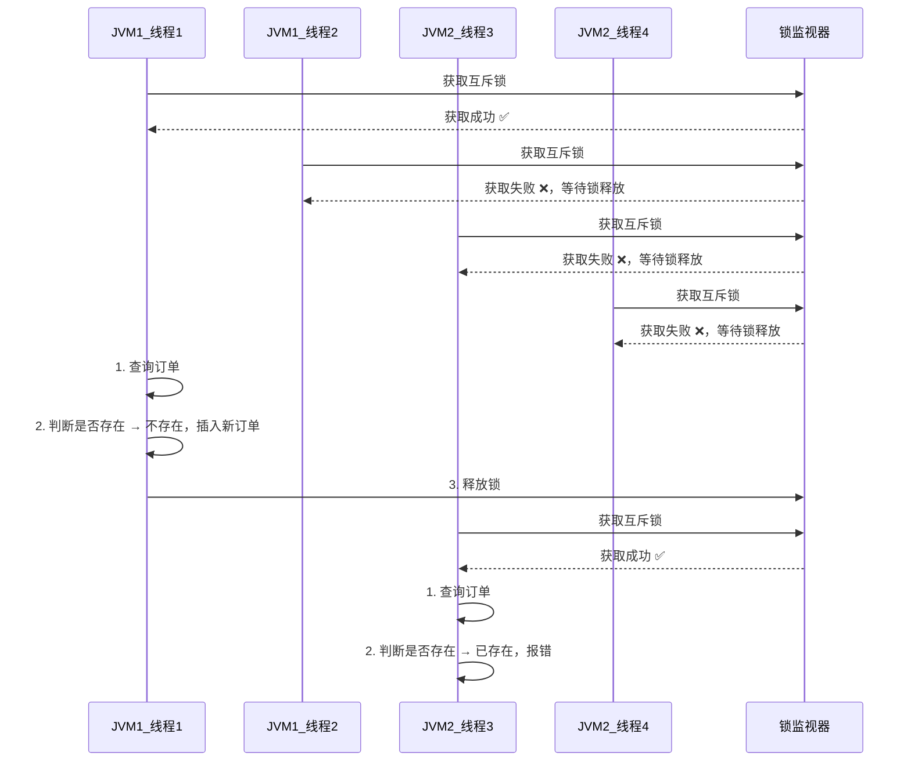
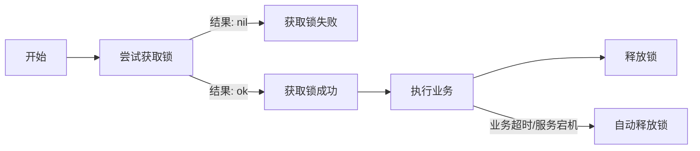
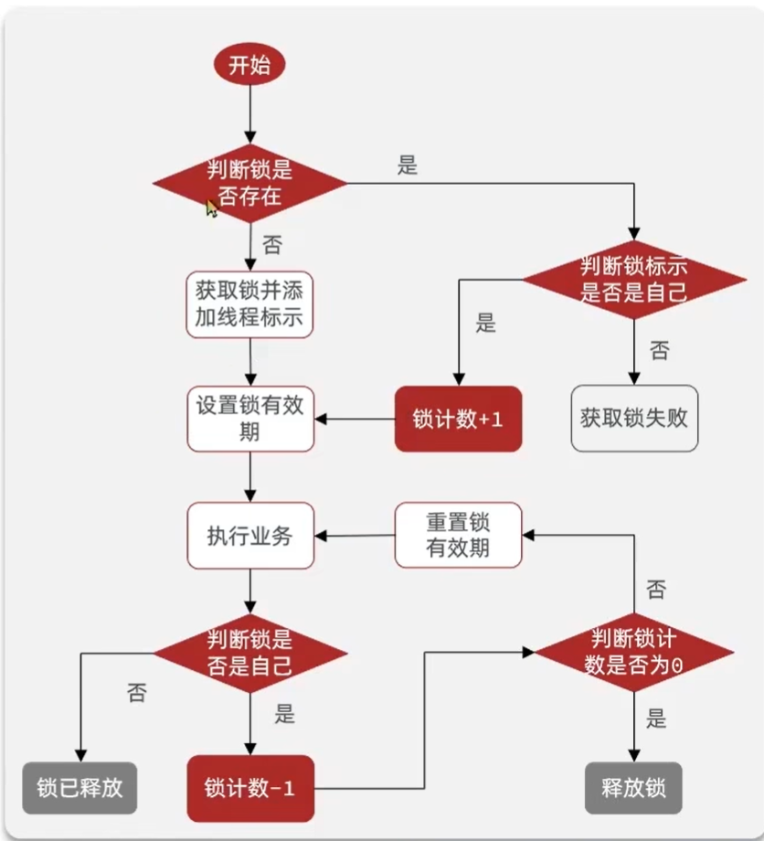

# 全局ID生成器

全局ID生成器，是一种在分布式系统下用来生成全局唯一ID的工具，一般要满足下列特性：



---

## 基于Redis的安全ID结构

为了增加ID的安全性，我们可以不直接使用Redis自增的数值，而是拼接一些其它信息：

### ID的组成部分
| 部分 | 大小 | 说明 |
| --- | --- | --- |
| 符号位 | 1bit | 永远为0 |
| 时间戳 | 31bit | 以秒为单位，可以使用69年 |
| 序列号 | 32bit | 秒内的计数器，支持每秒产生2^32个不同ID |

### 二进制结构示意
```
0 - 00000000 00000000 00000000 00000000 - 00000000 00000000 00000000 00000000
↑           ↑                             ↑
符号位      时间戳(31bit)                 序列号(32bit)
```

# 超卖问题与锁机制

## 超卖问题的产生
多线程并发执行“查询库存→判断库存→扣减库存”流程时，会出现库存超卖的线程安全问题：



---

## 常见解决方案：加锁

### 悲观锁
- **核心思想**：认为线程安全问题一定会发生，因此在操作数据之前先获取锁，确保线程串行执行。
- **常见实现**：`Synchronized`、`Lock` 等。

### 乐观锁
- **核心思想**：认为线程安全问题不一定会发生，因此不加锁，只是在更新数据时去判断有没有其它线程对数据做了修改。
- **处理逻辑**：
  - 如果没有修改则认为是安全的，自己才更新数据。
  - 如果已经被其它线程修改说明发生了安全问题，此时可以重试或抛出异常。

---

## 乐观锁的常见实现方式

### CAS法（Compare And Swap）
通过在更新时对比“查询时的库存值”和“当前数据库的库存值”，来判断数据是否被修改：

1.  **线程1** 查询库存为 `1`，执行扣减：
    ```sql
    UPDATE stock SET stock = stock - 1 WHERE id = 10 AND stock = 1;
    ```
    → 条件成立，扣减成功，库存变为 `0`。

2.  **线程2** 同样查询库存为 `1`，执行相同SQL：
    ```sql
    UPDATE stock SET stock = stock - 1 WHERE id = 10 AND stock = 1;
    ```
    → 此时数据库库存已为 `0`，条件不成立，更新失败，避免超卖。

> 这里可以改成看stock是否>0，因为如果看stock是否与上一次查询一致的话可能出现同时100次尝试实际一次成功的情况



# 分布式锁

## 什么是分布式锁
分布式锁是满足分布式系统或集群模式下，**多进程可见并且互斥**的锁。

它的核心特性包括：
- **多进程可见**：不同JVM、不同机器上的进程都能感知到锁的状态
- **互斥**：同一时间只有一个进程能持有锁
- **高可用**：锁服务本身要具备高可用性，避免单点故障
- **高性能**：加锁、解锁的性能开销要小
- **安全性**：避免死锁，确保锁能被正确释放

---

## 分布式锁的工作流程
在分布式场景下，多线程/多进程通过竞争同一把锁来保证操作的串行执行：



---

## 分布式锁的常见实现方式
| 特性 | MySQL | Redis | Zookeeper |
| --- | --- | --- | --- |
| **互斥** | 利用MySQL本身的互斥锁机制 | 利用`SETNX`等互斥命令 | 利用节点的唯一性和有序性实现互斥 |
| **高可用** | 好 | 好 | 好 |
| **高性能** | 一般 | 好 | 一般 |
| **安全性** | 断开连接，自动释放锁 | 利用锁超时时间，到期释放 | 临时节点，断开连接自动释放 |

### 基于Redis的分布式锁（方案一）

#### 核心方法
实现Redis分布式锁，需要实现两个基本方法：

##### 1. 获取锁
- **核心要求**：
  - **互斥**：确保同一时间只有一个线程能获取锁
  - **非阻塞**：尝试一次，成功返回`true`，失败返回`false`
- **命令实现**：
  ```redis
  # 添加锁，NX是互斥、EX是设置超时时间
  SET lock thread1 NX EX 10
  ```
  - `NX`：仅当key不存在时才设置，保证互斥
  - `EX 10`：设置key的过期时间为10秒，防止死锁

---

##### 2. 释放锁
- **核心要求**：
  - **手动释放**：业务执行完成后主动删除锁
  - **超时释放**：获取锁时添加超时时间，避免服务宕机导致死锁
- **命令实现**：
  ```redis
  # 释放锁，删除即可
  DEL key
  ```

> 这样会有一个问题：如果业务执行时间超过了锁的超时时间，那么就会导致锁被自动释放，但是业务还没有执行完，这就会导致别的进程也拿到锁，此时业务完成主动释放的是别的进程的锁。
>> 如何防止释放别人的锁？可以通过加一个标识（比如UUID），在释放锁时判断是否是当前线程的锁，并且将检查与删除锁当成一个事务。但是这样依旧存在问题，就是有两个进程都发起了请求。

---

#### 执行流程


# Redis的Lua脚本与Redisson可重入锁

## 一、Redis Lua脚本调用基础
Lua脚本可以在Redis中原子性地执行多个命令，是实现复杂分布式锁的关键。

### 调用语法
```redis
EVAL script numkeys key [key ...] arg [arg ...]
```
- `script`：Lua脚本内容
- `numkeys`：脚本中使用的`KEYS`数组长度
- `key`：会被放入`KEYS`数组
- `arg`：会被放入`ARGV`数组

### 示例1：固定参数脚本
```redis
EVAL "return redis.call('set', 'name', 'jack')" 0
```
- 这里`numkeys=0`，表示脚本中没有使用`KEYS`数组

### 示例2：动态参数脚本
```redis
EVAL "return redis.call('set', KEYS[1], ARGV[1])" 1 "name" "Rose"
```
- `KEYS[1]`：对应传入的`"name"`
- `ARGV[1]`：对应传入的`"Rose"`

---

## 二、Redisson可重入锁原理
Redisson的可重入锁通过**哈希结构**存储锁的持有线程和重入次数，实现了线程安全的可重入特性。

Redisson 实现可重入锁的核心在于它不只是简单地在 Redis 里存一个 `String`，而是使用 **Redis Hash (哈希)** 结构。

这种结构允许它在同一个 Key 下存储多个字段，从而能够同时记录“**谁拿着锁**”和“**进去了几次**”。

---

### 1. 哈希结构的内部布局

在 Redis 中，Redisson 锁的数据结构看起来像这样：

| Redis Key (锁的名字) | Hash Field (持有者标识) | Hash Value (重入次数) |
| --- | --- | --- |
| `anyLock` | `UUID:ThreadID` | `1` |

* **Key**: 锁的名称（例如 `order_lock_123`）。
* **Field (Key 内部的键)**：**客户端 UUID + 线程 ID**。这是全局唯一的，确保 Redis 知道这把锁属于哪台机器的哪个线程。
* **Value (Key 内部的值)**：一个整数，代表**重入计数器**。

---

### 2. 流程演示：从 0 到 2 再到 0

#### 第一步：首次加锁 (Lock)

当线程 A 尝试获取锁时，Redis 执行 Lua 脚本：

1. 检查 `anyLock` 是否存在。
2. 不存在，则创建哈希表，写入 `Field="ThreadA", Value=1`。
3. 设置过期时间（如 30 秒）。

#### 第二步：重入加锁 (Re-enter)

线程 A 再次执行 `lock()`：

1. 检查 `anyLock` 是否存在。
2. 发现已存在，接着检查 `Field` 是不是 `ThreadA`。
3. **匹配成功**：说明是同一个线程。
4. 执行 `HINCRBY anyLock ThreadA 1`，此时 `Value` 变成 **2**。
5. **续期**：重新刷新过期时间。

#### 第三步：释放锁 (Unlock)

线程 A 执行 `unlock()`：

1. 检查 `Field` 是否匹配。
2. 匹配，则执行 `HINCRBY anyLock ThreadA -1`。
3. **判断计数器**：
* 如果 `Value` 依然 **> 0**（说明还有外层逻辑没跑完），锁继续保持，不删除。
* 如果 `Value` 等于 **0**，说明所有嵌套逻辑已退出，执行 `DEL anyLock` 正式释放。

---

### 3. 为什么必须用 Lua 脚本处理这个哈希？

操作哈希结构涉及多个步骤：`判断是否存在` -> `判断持有者` -> `计数加减` -> `设置过期时间`。

如果在 go 层面分多次调用 Redis 命令，高并发下会发生：

* 线程 A 刚判断完是自己的锁，还没来得及加计数，锁就过期被线程 B 抢走了。
* 此时 A 再去加计数，就会搞乱 B 的锁数据。

**Redisson 将整个逻辑封装在一段 Lua 脚本中发送给 Redis。** 由于 Redis 执行 Lua 脚本是原子的，这保证了上述“检查-递增-续期”过程不会被任何其他客户端打断。

---

### 4. 这种设计的优缺点

* **优点**：
* **完美兼容递归/嵌套**：解决了 Java 原生代码移植到分布式环境时的死锁问题。
* **信息丰富**：通过哈希表，运维人员可以直接在 Redis 里看到到底是哪个实例的哪个线程挂住了锁。


* **缺点**：
* **比简单 String 略慢**：操作 Hash 的性能开销微高于操作 String，但在绝大多数业务场景下可以忽略不计。


### 核心流程



### 代码示例
```go
func method1() {
	// 创建锁对象
	lock := redissonClient.GetLock("lock")
	ctx := context.Background()

	// 尝试获取锁（无超时）
	isLock, err := lock.TryLock(ctx)
	if err != nil {
		log.Printf("获取锁时发生错误: %v", err)
		return
	}
	if !isLock {
		log.Println("获取锁失败，1")
		return
	}

	// 确保锁最终被释放
	defer func() {
		log.Println("释放锁，1")
		if err := lock.Unlock(ctx); err != nil {
			log.Printf("释放锁失败: %v", err)
		}
	}()

	log.Println("获取锁成功，1")
	method2()
}

func method2() {
	// 创建锁对象
	lock := redissonClient.GetLock("lock")
	ctx := context.Background()

	// 尝试获取锁（无超时）
	isLock, err := lock.TryLock(ctx)
	if err != nil {
		log.Printf("获取锁时发生错误: %v", err)
		return
	}
	if !isLock {
		log.Println("获取锁失败，2")
		return
	}

	// 确保锁最终被释放
	defer func() {
		log.Println("释放锁，2")
		if err := lock.Unlock(ctx); err != nil {
			log.Printf("释放锁失败: %v", err)
		}
	}()

	log.Println("获取锁成功，2")
}
```

---

## 三、核心Lua脚本实现

### 获取锁的Lua脚本
```lua
local key = KEYS[1]; -- 锁的key
local threadId = ARGV[1]; -- 线程唯一标识
local releaseTime = ARGV[2]; -- 锁的自动释放时间

-- 判断锁是否存在
if(redis.call('exists', key) == 0) then
    -- 不存在，获取锁
    redis.call('hset', key, threadId, '1');
    -- 设置有效期
    redis.call('expire', key, releaseTime);
    return 1; -- 返回结果
end;

-- 锁已经存在，判断threadId是否是自己
if(redis.call('hexists', key, threadId) == 1) then
    -- 是自己的锁，重入次数+1
    redis.call('hincrby', key, threadId, '1');
    -- 设置有效期
    redis.call('expire', key, releaseTime);
    return 1; -- 返回结果
end;

return 0; -- 代码走到这里，说明获取锁的不是自己，获取锁失败
```

### 释放锁的Lua脚本
```lua
local key = KEYS[1]; -- 锁的key
local threadId = ARGV[1]; -- 线程唯一标识
local releaseTime = ARGV[2]; -- 锁的自动释放时间

-- 判断当前锁是否还是被自己持有
if (redis.call('HEXISTS', key, threadId) == 0) then
    return nil; -- 如果已经不是自己，则直接返回
end;

-- 是自己的锁，则重入次数-1
local count = redis.call('HINCRBY', key, threadId, -1);

-- 判断是否重入次数是否已经为0
if (count > 0) then
    -- 大于0说明不能释放锁，重置有效期然后返回
    redis.call('EXPIRE', key, releaseTime);
    return nil;
else 
    -- 等于0说明可以释放锁，直接删除
    redis.call('DEL', key);
    return nil;
end;
```

