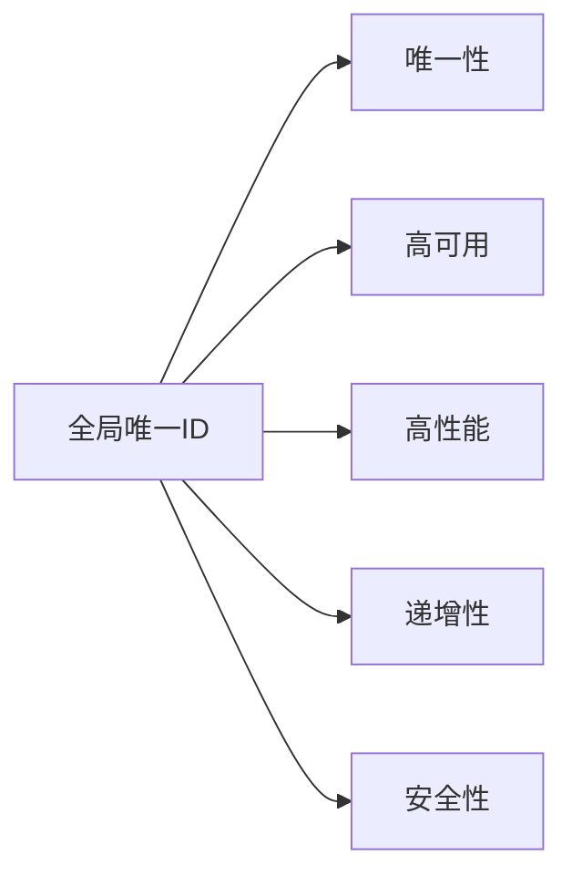
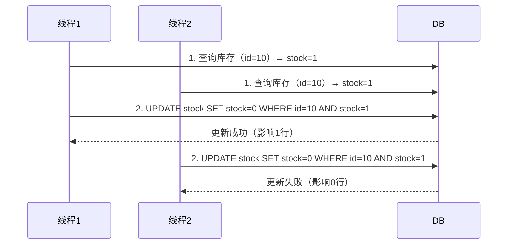

# 全局ID生成器

全局ID生成器，是一种在分布式系统下用来生成全局唯一ID的工具，一般要满足下列特性：



---

## 基于Redis的安全ID结构

为了增加ID的安全性，我们可以不直接使用Redis自增的数值，而是拼接一些其它信息：

### ID的组成部分
| 部分 | 大小 | 说明 |
| --- | --- | --- |
| 符号位 | 1bit | 永远为0 |
| 时间戳 | 31bit | 以秒为单位，可以使用69年 |
| 序列号 | 32bit | 秒内的计数器，支持每秒产生2^32个不同ID |

### 二进制结构示意
```
0 - 00000000 00000000 00000000 00000000 - 00000000 00000000 00000000 00000000
↑           ↑                             ↑
符号位      时间戳(31bit)                 序列号(32bit)
```

# 超卖问题与锁机制

## 超卖问题的产生
多线程并发执行“查询库存→判断库存→扣减库存”流程时，会出现库存超卖的线程安全问题：


---

## 常见解决方案：加锁

### 悲观锁
- **核心思想**：认为线程安全问题一定会发生，因此在操作数据之前先获取锁，确保线程串行执行。
- **常见实现**：`Synchronized`、`Lock` 等。

### 乐观锁
- **核心思想**：认为线程安全问题不一定会发生，因此不加锁，只是在更新数据时去判断有没有其它线程对数据做了修改。
- **处理逻辑**：
  - 如果没有修改则认为是安全的，自己才更新数据。
  - 如果已经被其它线程修改说明发生了安全问题，此时可以重试或抛出异常。

---

## 乐观锁的常见实现方式

### CAS法（Compare And Swap）
通过在更新时对比“查询时的库存值”和“当前数据库的库存值”，来判断数据是否被修改：

1.  **线程1** 查询库存为 `1`，执行扣减：
    ```sql
    UPDATE stock SET stock = stock - 1 WHERE id = 10 AND stock = 1;
    ```
    → 条件成立，扣减成功，库存变为 `0`。

2.  **线程2** 同样查询库存为 `1`，执行相同SQL：
    ```sql
    UPDATE stock SET stock = stock - 1 WHERE id = 10 AND stock = 1;
    ```
    → 此时数据库库存已为 `0`，条件不成立，更新失败，避免超卖。

> 这里可以改成看stock是否>0，因为如果看stock是否与上一次查询一致的话可能出现同时100次尝试实际一次成功的情况



